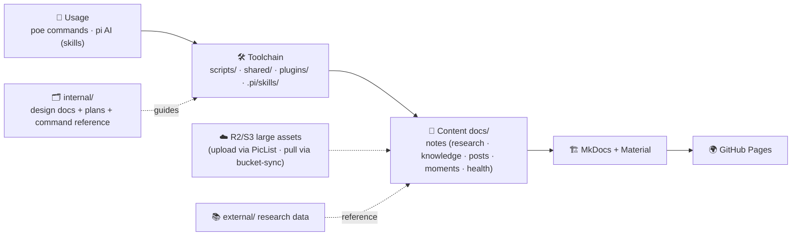

# recycle.bin

Personal notes & research log — built with [MkDocs](https://www.mkdocs.org/) +
[Material for MkDocs](https://squidfunk.github.io/mkdocs-material/), deployed
to GitHub Pages.



## Quick Start

```bash
uv sync
uv run poe server
```

Site runs at `http://localhost:8000` with hot-reload (includes drafts).

## Commands

All common commands (dev / build / quality / content / health / assets) are
centralized in [internal/commands.md](internal/commands.md). Core flow:

```bash
uv run poe server        # dev server (with drafts)
uv run poe build         # production build
uv run poe fmt && uv run poe lint-py && uv run poe test   # quality checks
uv run poe create-post "Title"     # new blog post
uv run poe create-moment "Text"    # new Moment
uv run poe enu add "cumbersome"    # English Scraps capture
```

## CI / Deployment

`.github/workflows/ci.yml` — `lint` job (pytest, ruff, mdformat, MkDocs
build check) on all branches and pull requests; `deploy` job publishes the
site to GitHub Pages on push to `master` as a **workflow artifact**
(`actions/deploy-pages`) — the `gh-pages` branch is not used. Set
`GIT_HASH` env var to embed the commit hash into the page HTML.

## Prototypes

Experimental mini-projects live in `prototypes/<name>/` — committed with the
repo, each with its own English `README.md` and `.gitignore`, skipped by the
main Python/markdown toolchain (`poe fmt` / `poe lint-py` / CI).

- Index: [prototypes/README.md](prototypes/README.md)
- Site page: [Prototypes](docs/notes/prototypes.md)
- Convention details: `AGENTS.md` → Prototype Convention

## Design Documents

Detailed design docs live in `internal/`:

- [Architecture](internal/architecture.md) — project structure, plugins, hooks, env vars, draft system
- [Commands](internal/commands.md) — command reference
- [Moment Design](internal/moment-design.md) — Micro-post timeline plugin
- [Bucket Assets Design](internal/bucket-design.md) — large files on R2/S3, PicList/rclone sync
  (`poe bucket-sync pull` incremental mirror · `poe bucket-check` orphan/broken-link audit ·
  `poe bucket-upload` WebP + rename)
- [md2wechat Design](internal/md2wechat-design.md) — WeChat HTML converter
- [optimize-images Design](internal/optimize-images-design.md) — WebP conversion pipeline
- [Weight Tracker Design](internal/weight-tracker-design.md) — weight data & tooling
- [Running Track Design](internal/running-track-design.md) — running data sync & rendering
- [Health Summary Design](internal/health-summary-design.md) — AI health summary via local `pi`
- [Bot Auto PR Design](internal/bot-auto-pr-design.md) — local bot: worktree-isolated auto PR (weight/moment/… → draft PR → CI gate → auto-merge)
- [Discuss System Design](internal/discuss-design.md) — Giscus comment system
- [Retirement Countdown Design](internal/retirement-countdown-design.md) — retirement calculator & visualization
- [GPS Tracker Design](internal/gps-tracker-design.md) — Notes Tools: phone GPS location recorder (vine map, multi-mark, out-of-region handling)

Plans (task/feature tracking) live in [internal/plans/plan-index.md](internal/plans/plan-index.md).

## Structure (top-level)

```
internal/          # Dev docs & plans: design docs, commands, architecture.md,
                   #   plans/plan-index.md, archived plans in plans/arch/
prototypes/        # Experimental mini-projects (index: prototypes/README.md)
shared/            # Shared Python utilities for plugins & scripts (strings, frontmatter, date, io)
scripts/           # CLI utility scripts (create_post, create_moment, enu, sync_running, …)
plugins/           # Custom MkDocs hooks (draft_filter, mermaid_assets, mkdocs_moment)
tests/             # pytest unit & integration tests
overrides/         # Theme overrides (comments, meta tags, external links)
docs/
├── index.md         # Redirect → /notes/
├── moments/         # Short micro-posts (Moment plugin)
├── notes/
│   ├── index.md      # Landing page (mermaid + about)
│   ├── collection/   # Curated links by domain
│   ├── research/     # Deep-dive notes (source code analysis, learning plans) under topics/
│   ├── knowledge/    # Long-term knowledge base (topic dirs, sub-projects)
│   ├── prototypes.md # Prototype index page (GitHub jumps)
│   ├── health/       # Health tracking (weight, retirement, running, AI summary)
│   └── posts/        # Blog archive (MkDocs blog plugin)
├── projects/        # Project outputs
└── discuss/         # Giscus comment page

external/           # External research data (source clones, books, …; never committed)
```
