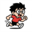

# :material-home: recycle.bin

某码农的笔记网站，包含以下内容:

- [Blogs & TILs (Today I learned)](notes/index.md)
- [Tech Notes](tech/backend.md)

--- 

## :material-information-variant: About me

- :material-github: [xiongjia](https://github.com/xiongjia){:target="\_blank"}
- :octicons-mail-24: [lexiongjia@gmail.com](mailto:lexiongjia@gmail.com)
- :material-rss: [RSS](/feed_rss_created.xml){:target="\_blank"}

---

## :material-tune-vertical-variant: 其他

###  [Running Otaku](https://xiongjia.github.io/running_page/){:target="\_blank"}

用来同步展示自己 Garmin 手表的跑步数据。(基于 [@yihong0618](https://github.com/yihong0618){:target="\_blank"} 的 [Running Page](https://github.com/yihong0618/running_page){:target="\_blank"} )

### :material-web: [seedling](https://xiongjia.github.io/seedling/){:target="\_blank"} 

React 写的 Dashboard Demo UI 支持多语言，多皮肤模式，用来整理日常开发的组件原型:

- [自动部署在 Github page 上的演示:material-earth:](https://xiongjia.github.io/seedling/){:target="\_blank"} 
- [文档库 :material-file-document:](https://xiongjia.github.io/seedling/docs/){:target="\_blank"}
