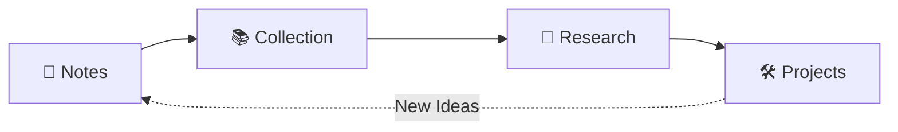

# :material-home: recycle.bin

某码农的笔记

Collect → Research → Build

```mermaid
graph LR
  A["📝 Notes"] --> B["📚 Collection"]
  B --> C["🔬 Research"]
  C --> D["🛠️ Projects"]
  D -.->|New Ideas| A

  click A "/notes/" "Notes"
  click B "/collection/" "Collection"
  click C "/research/" "Research"
  click D "/side-projects/" "Projects"
```

______________________________________________________________________

## :material-information-variant: 关于我

- :material-github: [xiongjia](https://github.com/xiongjia)
- :octicons-mail-24: [lexiongjia@gmail.com](mailto:lexiongjia@gmail.com)
- :material-rss: [RSS](/feed_rss_created.xml)
