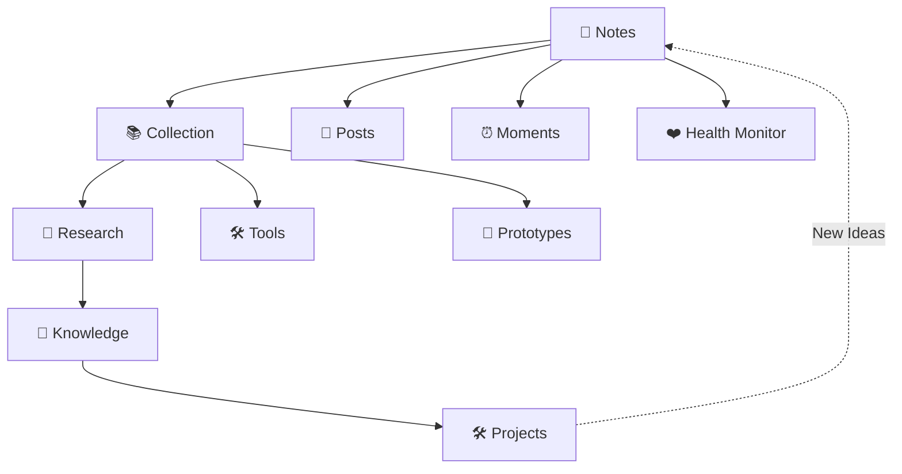

# :fontawesome-solid-note-sticky: NOTES

笔记📒 & 碎片🧩 & 垃圾回收♻️

Collect → Research → Build
Posts · Moments · Health Monitor

> ⚠️ 本站笔记**部分内容由 AI 生成**，仅供参考学习使用。

______________________________________________________________________

## :material-information-variant: 关于我

- :material-github: [xiongjia](https://github.com/xiongjia)
- :octicons-mail-24: [lexiongjia@gmail.com](mailto:lexiongjia@gmail.com)
- :material-rss: [Posts RSS](/feed_rss_created.xml)
- :material-rss: [Moments RSS](/moments/feed.xml)
