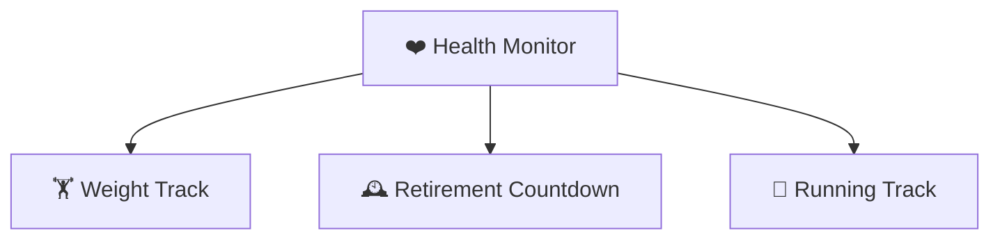

# 📊 Health Monitor

日常健康追踪

______________________________________________________________________

- [🏋️ **Weight Track**](./weight.md) — track my weight, BMI, and daily grid
- [🕰️ **Retirement Countdown**](./retire.md) — countdown to retirement
- [🏃 **Running Track**](./running.md) — running stats synced from running_page
