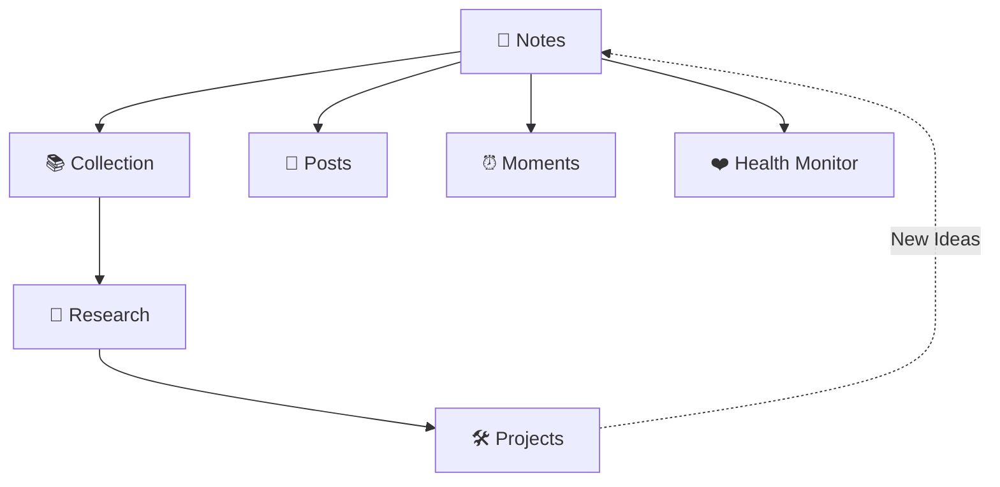

# :fontawesome-solid-note-sticky: NOTES

笔记📒 & 碎片🧩 & 垃圾回收♻️

Collect → Research → Build
Posts · Moments · Health Monitor

______________________________________________________________________

## :material-information-variant: 关于我

- :material-github: [xiongjia](https://github.com/xiongjia)
- :octicons-mail-24: [lexiongjia@gmail.com](mailto:lexiongjia@gmail.com)
- :material-rss: [RSS](/feed_rss_created.xml)
