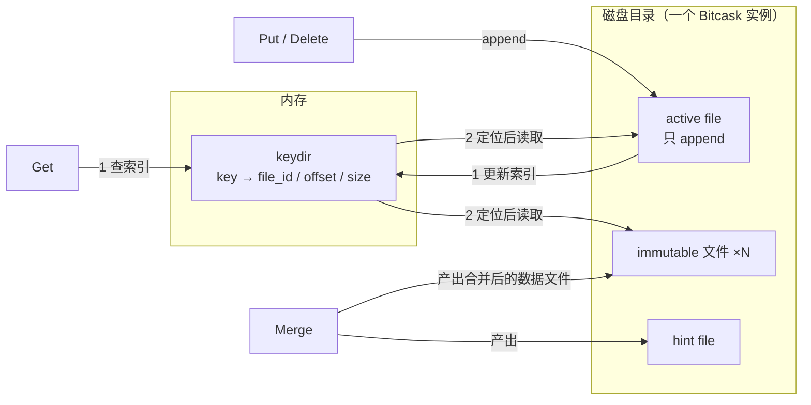

---
hide:
  - navigation
title: Bitcask 存储模型（日志结构哈希表）
tags:
  - knowledge
  - database
  - kv
  - bitcask
  - log-structured
  - storage-engine
categories:
  - database
---

# Bitcask 存储模型（日志结构哈希表）

> Bitcask 是 Basho Technologies 在 2010 年为 Riak 设计的本地 KV 存储模型，论文
> *Bitcask: A Log-Structured Hash Table for Fast Key/Value Data*。设计灵感来自
> 1980–90 年代的 log-structured file system 与「哈希表 + 日志合并」的思路。
>
> 一句话概括：**只有 append 的日志文件 + 全部 key 常驻内存的索引（keydir）**。
> 本文结合论文与 rosedb（Go 实现）源码总结其数据结构、读写路径与优劣。

## 核心模型

- 一个 Bitcask 实例 = **一个目录**，同一时刻只允许一个进程以可写方式打开
  （该进程即「数据库服务」）；只读方式可以并发打开。
- 目录中任一时刻只有一个 **active file** 接受写入。写满阈值后 rotate：
  active file 关闭并成为 **immutable** 文件，永不再次打开写入，同时新建一个
  active file。
- 写入只做 **append**，不改动旧数据；删除也只是一次特殊的 tombstone 写入。
- append 完成后更新内存中的 **keydir**：`key → (file_id, offset, size)`。
- 读操作先查 keydir，再按位置读一次磁盘，**最多一次 seek**。
- 空间回收靠 **merge（compaction）**：遍历 immutable 文件，只保留每个 key 的
  最新版本，并生成 **hint file** 加速下次启动。

因为节点本地存储对 Riak 是可插拔的，Bitcask 从一开始就被设计成通用本地 KV
引擎，而不只是 Riak 的内部件。

## 数据结构

### 磁盘：append-only 数据文件

每条 entry 追加写到 active file，格式为固定头部 + 变长 key / value：

```text
┌───────────┬───────────┬──────────┬────────────┬──────┬───────┐
│ CRC       │ timestamp │ key size │ value size │ key  │ value │
│ 4 bytes   │ 4 bytes   │ 2 bytes  │ 4 bytes    │ 变长 │ 变长  │
└───────────┴───────────┴──────────┴────────────┴──────┴───────┘
                     header 14 bytes
```

- **CRC32** 覆盖头部其余字段 + key + value，读取时校验，用于发现尾部半写/损坏记录。
- **timestamp** 记录写入时间，用于 TTL / 过期与统计；判断「哪个版本 live」靠的是
  keydir 中的最新位置，而不是逐条比较时间戳。
- key 上限 65535 字节（Basho 用 2 bytes 存 key 长度），value 上限 2³²−1 字节（4 bytes 存长度）。
- 数据文件本身就是 commit log：**数据与日志是同一份**，所以崩溃恢复不需要
  「replay 日志」。

> 字段顺序与宽度取自 Basho 原始实现 `include/bitcask.hrl`：`?HEADER_SIZE = 14 = 4 + 4 + 2 + 4`。
> 不同实现可自选编码（rosedb 改用 varint，见下文）。

### 内存：keydir

keydir 是「所有 key → 最新 entry 的物理位置」的映射，论文用哈希表：

```text
keydir (内存)                              磁盘
"user:1" ──► {file_id, offset, size} ──►  active / immutable 文件中的 value
"user:2" ──► {file_id, offset, size} ──►
```

关键点：

- 条目是**定长**的（file_id + offset + size，与 value 大小无关），所以内存开销
  ≈ key 数量 × 固定开销 + key 本身的大小。
- 写入时 keydir **原子替换**为新位置；旧 value 仍留在磁盘，直到 merge 清理。
- 同一进程内多个使用者打开同一 Bitcask 时**共享同一份 keydir**（Basho 实现为
  同一 Erlang VM），避免重复构建索引。
- 因此**整个 keyspace 必须能放进内存** —— 这是 Bitcask 的硬约束，也是它最大的
  取舍。论文的说法是：即使数百万 key，实现也只占用远小于 1GB 的内存。

### hint file 与 merge

merge 遍历所有 immutable 文件：

- 只输出每个 key 的**最新版本**，被覆盖的旧记录与 tombstone 直接丢弃；
- 为每个数据文件生成一个 **hint file**：结构与数据文件类似，但不含 value，
  只存「timestamp + key size + total size + offset + key」（固定 18 字节 + key，
  Basho 称 `?HINT_RECORD_SZ`），文件末尾另有一条终止用的 CRC 记录；
- 启动时若有 hint file，直接扫描 hint file 重建 keydir，避免读取全部 value，
  启动时间大幅缩短。

### 读写路径



## 优劣

### 优势

| 优势               | 原因                                                                                                                  |
| ------------------ | --------------------------------------------------------------------------------------------------------------------- |
| 写延迟低、吞吐高   | 只 append，顺序写、几乎无磁盘寻道；随机写流被转换成顺序写。论文在慢盘笔记本上实测 5000–6000 writes/s，中位延迟 sub-ms |
| 读路径固定、可预测 | keydir 内存定位 + 最多一次磁盘 seek；实际常被 OS filesystem cache（read-ahead）命中，更快                             |
| 数据量可远大于内存 | value 放在磁盘，只有 key 必须在内存。论文实测数据集 >10×RAM 时行为无退化                                              |
| 崩溃恢复快且简单   | 数据文件即日志，无需 replay；最多丢尾部半写记录（CRC 可检测）。hint file 进一步加速启动                               |
| 备份 / 恢复极简    | rotate 后的文件不可变，任何按磁盘块顺序 copy 的工具都能正确备份；恢复 = 把数据文件放回目录                            |
| 实现 / 格式简单    | 没有 LSM 的多层 compaction、Bloom filter、block cache；代码与数据格式都易理解、易排障、易支持                         |
| 无读放大           | 索引精确（内存里直接给出位置），不像 LSM 需要逐层查找                                                                 |

### 劣势

| 劣势                      | 说明                                                                                                                         |
| ------------------------- | ---------------------------------------------------------------------------------------------------------------------------- |
| **所有 key 必须常驻内存** | keydir 随 key 数量线性增长；key 特别多或特别长时，内存成为硬上限，也是容量规划的主要约束                                     |
| 单写者                    | 同一时刻只有一个进程能写；多写者需要上层自己想办法                                                                           |
| 空间放大 + 必须 merge     | 旧版本与 tombstone 长期占磁盘，需要后台 merge 回收；merge 会重写 live data（写放大），并占用额外 I/O 与临时空间              |
| 范围查询弱                | 原始 keydir 是哈希表，不保持有序；`fold` / 全量扫描要遍历所有 key 并可能读盘。rosedb 改用内存 BTree 才补上有序迭代与范围扫描 |
| 无压缩                    | 论文明确不做压缩（收益强依赖应用）；value 越大，merge 需要重写的字节越多                                                     |

### 与 LSM-Tree 的关系

- Bitcask 可以看作「**只有一层、且全量 key 索引常驻内存**的 LSM」：同样是
  append-only 写入 + 后台合并，但 LSM 把 key 索引切成多层（SST + block index +
  Bloom filter），一次点查可能跨层多次 I/O；Bitcask 用内存换掉了这层查找。
- 代价正好相反：LSM 的 key 不必全部放内存，Bitcask 必须。
- Badger 是另一条路线（WiscKey）：LSM 存 key、单独 value log 存 value ——
  受 Bitcask 影响，但**不是** Bitcask。

## 适用场景

适合：

- 单机 KV，写吞吐优先（日志、消息、缓存落盘、元数据）；
- key 数量可控到能装进内存（百万到千万级，取决于 key 长度）；
- 以点查为主，范围扫描是次要需求；
- 希望「简单、易备份、易排障」胜过「极致存储效率」。

不适合：

- key 数量巨大或 key 超长，keydir 放不进内存；
- 需要多个进程 / 多个 writer 同时写同一份数据；
- 范围扫描是主路径，或不接受后台 merge 任务；
- 对磁盘空间放大极其敏感。

## 实现列表

按语言 / 生态：

| 实现                                                                    | 语言   | 说明                                                                                                                |
| ----------------------------------------------------------------------- | ------ | ------------------------------------------------------------------------------------------------------------------- |
| [basho/bitcask](https://github.com/basho/bitcask)                       | Erlang | 论文原始实现，Riak 的本地默认后端；tombstone、hint file、CRC 等定义都在此                                           |
| [rosedblabs/rosedb](https://github.com/rosedblabs/rosedb)               | Go     | 当前最活跃的实现（GitHub 4k+ stars）：WAL 分片 + 内存 BTree 索引，支持 batch / 迭代器 / watch / expire / 自动 merge |
| [rosedblabs/mini-bitcask](https://github.com/rosedblabs/mini-bitcask)   | Go     | 教学最小实现（单文件跑通 put / get / del / merge），适合先读懂模型                                                  |
| [krestenkrab/bitcask-java](https://github.com/krestenkrab/bitcask-java) | Java   | 早年对 Basho Bitcask 的 Java 移植                                                                                   |
| [darlinglele/bitcask](https://github.com/darlinglele/bitcask)           | Java   | 简洁的 Java 实现                                                                                                    |
| [dragonquest/bitcask](https://github.com/dragonquest/bitcask)           | Rust   | Rust 实现                                                                                                           |
| [dineshgowda24/bitcask-rb](https://github.com/dineshgowda24/bitcask-rb) | Ruby   | 跟随论文实现的 Ruby 版本（教学向）                                                                                  |
| [lambertse/bitcask](https://github.com/lambertse/bitcask)               | C++    | C++17 实现（CMake 工程）                                                                                            |

生产中的使用：

- **Riak**：每节点本地存储的默认引擎（Bitcask 的诞生背景）。

生态与实验：

- **RabbitMQ**：社区实验插件 `msg_store_bitcask_index` 用 Bitcask 做消息存储索引
  （作者自述「几乎未经测试」，未进入官方特性）。

### 案例：rosedb（Go）

rosedb 是当前最完整的开源实现，可作为「论文模型如何工程化」的参考：

| 论文概念             | rosedb 对应                                                                                                                                                                                                                              |
| -------------------- | ---------------------------------------------------------------------------------------------------------------------------------------------------------------------------------------------------------------------------------------- |
| append-only 数据文件 | `github.com/rosedblabs/wal`：分段 append-only 文件，默认 segment 1GB；文件内按 32KB block 切分，每个 chunk 带 7 字节头（CRC32(4) + 长度(2) + chunk 类型(1)，类型 Full / First / Middle / Last 支撑跨 block 切分），可检测尾部半写 / 损坏 |
| entry                | `LogRecord`：`type(1) + batchId(varint) + keySize(varint) + valueSize(varint) + expire(varint) + key + value`（varint 省空间，与论文固定宽度不同）                                                                                       |
| keydir（哈希表）     | 内存 **BTree** 索引（`index/btree.go`，包装 google/btree）—— 为支持有序遍历 / 范围扫描而偏离论文                                                                                                                                         |
| tombstone            | `LogRecordDeleted` 记录类型                                                                                                                                                                                                              |
| merge + hint file    | `merge.go`：先合并到 `<dir>-merge`（同级后缀目录），再把合并结果移回原目录并删除旧数据文件；hint file（`.HINT`）用于重启时快速重建 keydir，`.MERGEFIN` 标记 merge 已完成（重启时据此决定复用或重做 merge）                               |

除论文模型外，rosedb 还提供：原子 batch、正 / 反向迭代器、key watch、key expire、cron 自动 merge。

结论：**Bitcask 的数据结构很少，难点在工程实现**（并发、CRC 校验、merge 策略、
启动速度）—— 论文本身也承认（例如 keydir 的加锁方案）没有展开讲。

## 参考

- 论文：[Bitcask: A Log-Structured Hash Table for Fast Key/Value Data](https://riak.com/assets/bitcask-intro.pdf)（Basho, 2010）
- rosedb：<https://github.com/rosedblabs/rosedb>
- 原始实现与磁盘格式定义：basho/bitcask `include/bitcask.hrl`、`src/bitcask_fileops.erl`
