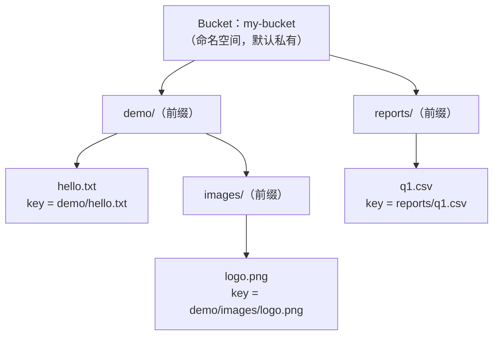
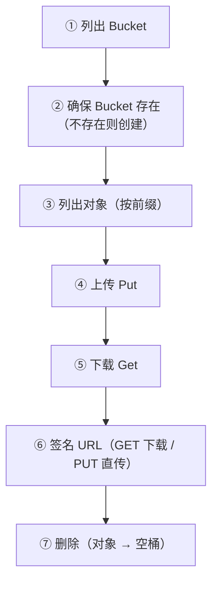
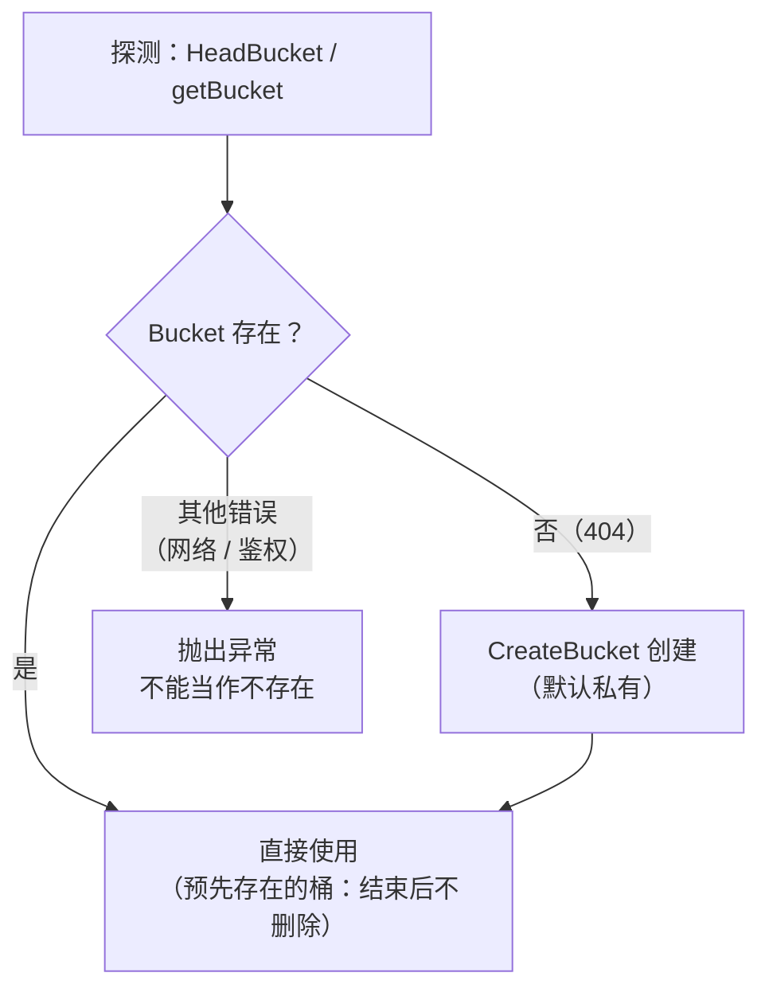
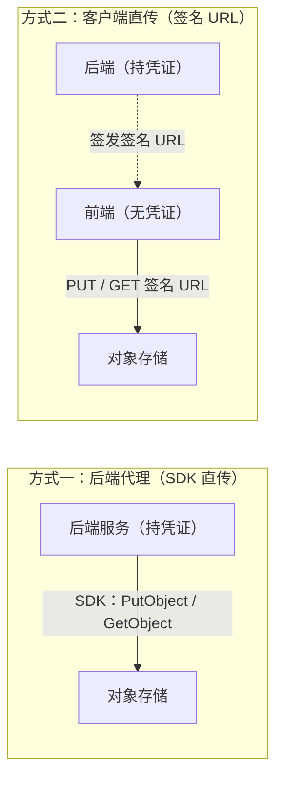

---
hide:
  - navigation
title: 对象存储基本用法（Bucket / Object / 常用操作）
tags:
  - knowledge
  - cloud
  - object-storage
  - basic-usage
categories:
  - infrastructure
---

# 对象存储基本用法（Bucket / Object / 常用操作）

> 对象存储的用法在各厂商间高度同构：核心概念（bucket、object、key）一致，
> 常用操作（列桶、建桶、列对象、上传、下载、签名 URL、删除）一一对应。
> 本文提炼**通用用法**；厂商差异见 [供应商对比（Vendors）](./vendors-comparison.md)，
> 签名 URL 原理见 [签名 URL（Signed URL）](./signed-url.md)。

## 核心概念

### Bucket（桶）

- 对象存储的顶层命名空间，容纳一组对象
- 名称在**同一厂商内全局唯一**（不同厂商之间可以重名）
- 默认**私有**（private）：匿名无法读取；公开桶（public）才可无鉴权访问
- 删除约束：**空桶才能删除**，非空桶删除会失败 —— 先删对象再删桶

### Object（对象）与 Key

- 对象 = **Key + 数据（Data）+ 元数据（Metadata，如 Content-Type）**
- **Key 是完整路径**（如 `demo/r2-client/hello.txt`）；对象存储里没有真正的
  目录 / 文件夹 —— "目录"只是 Key 的**前缀约定**（prefix），列对象时按前缀
  过滤即可实现"列目录"

### Region 与 Endpoint

- Endpoint 是服务入口地址，多数厂商由 region 派生（如 OSS
  `https://oss-cn-hangzhou.aliyuncs.com`）或由账号 ID 派生（如 R2
  `https://<ACCOUNT_ID>.r2.cloudflarestorage.com`）
- region 是否必需、如何派生，各厂商不同（详见 [供应商对比](./vendors-comparison.md#4-region-endpoint)）

> 概念关系总览：一个 Bucket 容纳若干对象，对象通过 Key 定位；带 `/` 的
> 前缀看起来像"目录"，实际上是 Key 的命名约定。



> 各厂商 SDK 对照：S3 系（R2 / MinIO / AWS）用 `@aws-sdk/client-s3` 的
> `ListBuckets / HeadBucket / CreateBucket / ListObjectsV2 / PutObject / GetObject / DeleteObject / DeleteBucket` 命令；OSS 用 `ali-oss` 的
> `listBuckets / list / put / get / delete`；Supabase 用
> `@supabase/supabase-js` 的 `storage.listBuckets() / getBucket() / createBucket() / from(bucket).list() / upload() / download() / remove()`。

典型操作流程（与各原型 demo 的执行顺序一致）：



### 1. 列出 Bucket

```ts
// S3 系（@aws-sdk/client-s3）
const { Buckets } = await client.send(new ListBucketsCommand({}));
```

- 该操作需要"列出所有桶"的权限 —— R2 的 API Token 需 **Admin Read & Write**，
  Object 级 Token 会 403（见 [供应商对比](./vendors-comparison.md#3-permission-model)）
- OSS 的 `listBuckets` 需传 `{}`（传 `null` 会崩，SDK 实现细节）

### 2. 确保 Bucket 存在（不存在则创建）

通用模式：先探测（HeadBucket / getBucket），404 表示不存在 → 创建。

```ts
// S3 系：HeadBucket 404 则 CreateBucket
try {
  await client.send(new HeadBucketCommand({ Bucket }));
  // 已存在，直接使用
} catch (err) {
  if (is404(err)) await client.send(new CreateBucketCommand({ Bucket }));
}
```

- 创建后 bucket 默认私有，即可直接使用
- 探测失败要区分 **404（真的不存在）** 与其他错误（网络 / 鉴权）—— 后者
  不能当"不存在"处理，否则会掩盖真实故障



### 3. 列出对象（按前缀）

```ts
// S3 系
const { Contents } = await client.send(
  new ListObjectsV2Command({ Bucket, Prefix: "demo/", MaxKeys: 20 }),
);
```

- `Prefix` 用于过滤"目录"；`MaxKeys` / `limit` 控制数量
- 结果可能分页：S3 的 `NextContinuationToken`、OSS 的 `nextMarker`
- 列表返回对象的 key 与大小（size），可用来实现"目录浏览"

### 4. 上传（Put）

```ts
// S3 系
await client.send(new PutObjectCommand({
  Bucket, Key, Body: Buffer.from(content), ContentType: "text/plain",
}));
```

- 同 key 重复上传 = **覆盖**（S3 系无版本控制时）；Supabase 需 `upsert: true`
  才能覆盖，否则报 `Duplicate`
- 建议显式设置 Content-Type，否则对象可能被存为默认类型

### 5. 下载（Get）

```ts
// S3 系
const { Body } = await client.send(new GetObjectCommand({ Bucket, Key }));
const text = await Body.transformToString();
```

- 小对象可直接读入内存；大对象应流式读取

### 6. 签名 URL（限时下载 / 客户端直传）

- 下载 URL（GET）：`getSignedUrl(client, new GetObjectCommand({...}), { expiresIn: 60 })`
- 上传 URL（PUT）：同上但用 `PutObjectCommand`
- 用途：前端直传 / 直下，数据不经过后端；原理与坑见
  [签名 URL（Signed URL）](./signed-url.md)

两种数据流对比：后端代理（SDK 直传）与客户端直传（签名 URL）



### 7. 删除

```ts
await client.send(new DeleteObjectCommand({ Bucket, Key }));  // 删对象
await client.send(new DeleteBucketCommand({ Bucket }));       // 删桶（须为空）
```

- **删除是幂等的**：删不存在的 key 也成功（S3 系；OSS 也返回 204）
- **非空桶删除失败**：先删对象再删桶；清理逻辑应 best-effort（失败报告但不致命）
- 清理原则：**只删自己创建的资源** —— 预先存在的 bucket 只写自己的前缀，
  运行结束后不删除该桶

## 通用机制与约定

- **前缀即目录**：用带 `/` 结尾的前缀组织对象（如 `demo/r2-client/`）；列对象 +
  前缀过滤 = 目录浏览；"删除目录" = 删该前缀下所有对象
- **默认私有**：bucket 默认不可匿名访问；公开访问要么设公开桶，要么用签名 URL
- **凭证不进代码**：凭据放环境变量（`.env`），git-ignore 掉 `.env*`，只提交
  `.env.example` 模板
- **浏览器直传需要 CORS**：浏览器端直传 / 直读签名 URL 时，还要给 bucket 配置
  CORS（允许的来源、方法、响应头）—— 这是独立于签名本身的配置
- **SDK 公共配置项**（S3 系常见）：
  - `endpoint`：可覆盖为本地测试服务（如 MinIO）
  - `forcePathStyle`：本地 MinIO 需要（localhost 无虚拟主机 DNS），真实云服务不需要
  - `region`：R2 忽略（用 `auto`）、MinIO 要 `us-east-1`
  - checksum 开关：新版 SDK 默认给 `PutObject` 加 CRC32 头，设
    `requestChecksumCalculation: "WHEN_REQUIRED"` 可保持上传纯净、兼容所有
    S3 兼容端点

## 参考

- 相关文档：[供应商对比（Vendors）](./vendors-comparison.md)、
  [签名 URL（Signed URL）](./signed-url.md)、
  [数据迁移（Migration）](./data-migration.md)
- 可运行示例：[Prototypes 列表](../../../../../notes/prototypes.md)：
  [ali-oss-client](../../../../../notes/prototypes.md#ali-oss-client) ·
  [r2-client](../../../../../notes/prototypes.md#r2-client) ·
  [supabase-storage-client](../../../../../notes/prototypes.md#supabase-storage-client)
  （各 README 含环境配置与 curl 验证步骤）
