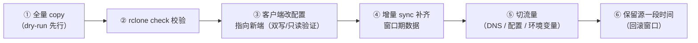

---
hide:
  - navigation
title: 对象存储数据迁移（R2 → MinIO / 跨厂商搬迁）
tags:
  - knowledge
  - cloud
  - object-storage
  - migration
  - rclone
categories:
  - infrastructure
---

# 对象存储数据迁移（R2 → MinIO / 跨厂商搬迁）

> 对象存储之间迁移数据（如 Cloudflare R2 → MinIO），主流做法是用
> **S3 兼容工具**（rclone、aws s3 sync、mc mirror）直接对拷，无需写业务代码。
> 本文以 rclone 为主线，覆盖迁移流程、配置要点与**客户端兼容性**注意事项。
> 各厂商差异背景见 [供应商对比（Vendors）](./vendors-comparison.md)。

## 为什么"搬迁"是 S3 兼容的生态红利

- R2 / MinIO / AWS 都走 S3 兼容 API：**源与目标都是 S3 系时，用同一个工具、
  同一套命令即可对拷**，数据层面零转换
- 迁移的本质 = 在两端各配一个"remote"，然后 copy / sync 对象（key、数据、
  元数据）
- 对比：OSS 走原生 API，跨厂商搬迁要先用工具导出成标准格式，或依赖云厂商
  自己的迁移服务，麻烦得多；Supabase 虽有 S3 协议但能力是子集，能直接对拷
  但受限（详见下文「Supabase 特例」）

## 工具选型

| 工具          | 适用场景                     | 说明                                                                   |
| ------------- | ---------------------------- | ---------------------------------------------------------------------- |
| **rclone**    | 通用跨厂商（首选）           | 支持几乎所有对象存储后端，配置抽象统一，`copy / sync / check` 一套走完 |
| `aws s3 sync` | S3 兼容之间                  | AWS 官方 CLI，覆盖 endpoint 即可用于 R2 / MinIO                        |
| `mc mirror`   | MinIO ↔ 其他 S3 兼容         | MinIO 客户端，语法简单                                                 |
| 云迁移服务    | 同云大规模迁移（如 AWS→AWS） | AWS DataSync、云厂商自带迁移工具；跨厂商一般不如 rclone 灵活           |

## rclone 迁移流程

### 1. 安装并配置两个 remote

`rclone config` 交互式创建，或直接写 `~/.rclone.conf`：

```ini
# 源：Cloudflare R2（S3 兼容）
[r2]
type = s3
provider = Cloudflare
access_key_id = <R2_ACCESS_KEY_ID>
secret_access_key = <R2_SECRET_ACCESS_KEY>
endpoint = https://<ACCOUNT_ID>.r2.cloudflarestorage.com
region = auto

# 目标：MinIO（S3 兼容，本地/自托管）
[minio]
type = s3
provider = Minio
access_key_id = <MINIO_ROOT_USER>
secret_access_key = <MINIO_ROOT_PASSWORD>
endpoint = http://127.0.0.1:9000
force_path_style = true
```

要点：

- **provider 字段**：`Cloudflare` / `Minio` 等预设值让 rclone 自动套用各家的
  默认行为（签名、endpoint 风格）
- **R2 的 region 传 `auto`**（被忽略）；endpoint 由 Account ID 派生
- **MinIO 必须 `force_path_style = true`**（本地无虚拟主机 DNS）
- 凭证放本机 rclone 配置，**不要**写进任何仓库文件

### 2. 先 dry-run，再正式迁移

```bash
# 预览将复制的对象（不实际传输）
rclone copy r2:my-bucket minio:my-bucket --dry-run

# 正式全量复制（同名覆盖，不删除目标多余对象 —— 安全）
rclone copy r2:my-bucket minio:my-bucket --progress

# 校验：默认对比大小与哈希（严格）；--size-only 仅比大小（快但不严格）
rclone check r2:my-bucket minio:my-bucket
```

### copy vs sync vs move

| 命令   | 行为                                     | 风险             |
| ------ | ---------------------------------------- | ---------------- |
| `copy` | 单向复制，**不删除**目标多余对象         | 低（推荐起步）   |
| `sync` | 目标与源对齐，**删除**目标中源没有的对象 | 高（先 dry-run） |
| `move` | 复制后**删除源**对象                     | 高（源被清空）   |

> 第一次迁移永远用 `copy`；确认无误、且确实需要目标与源完全一致时，再考虑
> `sync`。切流量后的增量补齐用 `sync` 最合适。

## 注意事项

### 1. Client 兼容性（迁移后客户端如何跟着切）

迁移不只是数据搬走，**客户端指向也要换**。S3 兼容客户端
（`@aws-sdk/client-s3`、aws cli、mc、rclone）切换只涉及 4 个配置项，
**业务代码零改动**：

| 配置项           | R2（源）                                        | MinIO（目标）              |
| ---------------- | ----------------------------------------------- | -------------------------- |
| `endpoint`       | `https://<ACCOUNT_ID>.r2.cloudflarestorage.com` | `http://<minio-host>:9000` |
| credentials      | R2 API Token                                    | MinIO root / 自定义用户    |
| `region`         | `auto`（忽略）                                  | `us-east-1`（默认）        |
| `forcePathStyle` | false（默认 virtual-hosted）                    | **true**                   |

排查清单：

- [ ] **endpoint 是否硬编码**：代码 / CI / 前端里若写死了
  `xxx.r2.cloudflarestorage.com`，统一改成环境变量注入
- [ ] **forcePathStyle**：本地 MinIO 必须 `true`；云服务（R2 / AWS）用默认
  virtual-hosted —— 同一份代码两套值，配置项要可覆盖
- [ ] **签名 URL**：迁移后原签名 URL 全部失效（域名、密钥、签名上下文都变），
  必须用新客户端重新签发；已下发给客户端 / 缓存 / CDN 的旧 URL 要清理
- [ ] **CORS**：若原本给 R2 bucket 配了 CORS（浏览器直传 / 直读），MinIO 的
  bucket 也要配，否则前端直传报跨域错误
- [ ] **非 S3 系客户端**：若原业务用的是 `ali-oss` / `@supabase/supabase-js`
  等原生 SDK，迁到 S3 兼容服务需要**重写客户端**（方法名、返回结构不同）
- [ ] **本地开发环境**：切换后开发环境的 endpoint 配置也要同步（如
  `.env` / `.env.example`），避免本地还指向旧服务

### 2. 数据层面的坑

- **元数据 / Content-Type**：rclone 的元数据复制**默认关闭**（需
  `--metadata` / `-M` 开启；开启后个别后端字段仍可能丢失，如自定义
  x-amz-meta-\*、存储类型）；迁移后抽查关键对象的 Content-Type 与元数据
- **校验方式**：`rclone check` 可用大小（`--size-only`）或校验和；S3 系的
  ETag 对**小对象等于 MD5，大对象（multipart）不是** —— 追求严格校验时用
  rclone 自己计算的哈希，不要只看 ETag
- **大文件**：rclone 默认自动分片（multipart），S3 兼容两端通常无兼容问题；
  注意设置合理的 `--transfers` / `--checkers` 并发控制带宽
- **版本与删除标记**：源若开启版本控制，rclone **默认不迁移历史版本**（列目录时
  用 `--s3-versions` 才看得到）；要迁移历史版本需显式开启，且**目标也要开启
  版本控制**才能保留（否则多版本同 key 互相覆盖）
- **存储类型 / 生命周期**：冷热分层（如 Glacier / 归档）迁移后通常退化为
  标准存储，存储费用与访问行为会变；对象存储本身的生命周期规则不会跟着
  对象走，需要在新端重建
- **ACL / 权限**：rclone 默认不复制桶级 ACL / Policy，目标 bucket 的权限
  体系（用户、Policy、公开/私有）要单独重建
- **大小写与命名**：S3 系 key 大小写敏感；从 OSS（大小写不敏感）迁出时，
  同名不同大小写的 key 可能冲突，需先清理

### 3. 网络与成本

- **出口流量**：从云上迁出会吃**出口流量费**（R2 免费、多数云计费）；从
  本地 MinIO 迁到云端则是上行，通常免费
- **带宽瓶颈**：本地 → 云端（或反向）的迁移速度受上传/下载带宽限制；大量
  小对象时请求数（QPS）也可能成为瓶颈
- **迁移窗口**：全量复制期间源端可能持续有新写入 —— 正确节奏是先全量
  `copy`，切流量后再 `sync` 补齐窗口期增量

### 4. 推荐的迁移节奏（双跑 → 切换 → 回滚窗口）



- 迁移期间建议**双写或只读窗口**：让新客户端先读 MinIO 验证，写入仍走源
  或两边都写，降低一次性切换的风险
- 切流量后不要立刻删源桶，保留一段回滚窗口（按数据重要性定，如 1~4 周）
- 验证手段：`rclone check` + 业务探针（下载几个代表对象对比大小/哈希）

## Supabase 特例（S3 协议是子集实现）

Supabase Storage 的 S3 兼容不是完整实现，官方维护一张
[S3 兼容性表](https://supabase.com/docs/guides/storage/s3/compatibility)：
核心端点齐全（ListBuckets、ListObjects V1/V2、Get/Put/Delete/DeleteObjects、
CopyObject、完整 Multipart 流程），但很多 S3 特性**明确不支持**，迁移时要有预期：

### 1. 不支持的特性（复制不走、校验需降级）

- **版本控制**：S3 versioning 不支持，删除即永久删除，无法恢复
- **ACL / Tagging / Object Lock / Storage Class / 生命周期 / SSE**：均不支持，
  迁入后这些属性无从保留
- **CORS 配置**：没有 S3 的 CORS API，浏览器直传/直读的 CORS 要在
  Supabase Dashboard 配置
- **Checksums**：不支持 `Content-MD5` / `x-amz-checksum-*`，`rclone check`
  的校验和对比会退化（详见下文 rclone 配置）

### 2. 凭证模型：全桶级 + 绕过 RLS

- 项目级 S3 Access Keys（Settings → Storage → S3）：**一对 key 管所有
  bucket、所有操作，并绕过 RLS** —— 只能放服务端，别进浏览器
- 对比 R2 的 Token 可按桶/按操作收缩，Supabase 的 S3 key 没有这个粒度；
  多租户 / 按用户限权要改用 **Session Token + 用户 JWT**（走 RLS）
- 迁入后若要 anon 访问，仍需先建 RLS policy（新版默认无 policy，全拒）

### 3. 端点与配置（rclone 无 Supabase 预设）

rclone 的 S3 provider 列表里**没有 Supabase**，需手动配通用 S3 remote：

```ini
[supabase]
type = s3
# 无 Supabase 预设：不设 provider，走通用 S3 签名
endpoint = https://<PROJECT_REF>.storage.supabase.co/storage/v1/s3
force_path_style = true
region = <PROJECT_REGION>   # 本地开发填 local
access_key_id = <S3_ACCESS_KEY_ID>
secret_access_key = <S3_SECRET_ACCESS_KEY>
```

- **必须 `force_path_style = true`**：endpoint 路径挂在 `/storage/v1/s3` 下，
  没有 virtual-hosted 形态
- **region 填项目 region**（官方示例如此）；本地开发用 `local`
- 大文件上传推荐用 storage 专用 hostname
  （`<ref>.storage.supabase.co` 而非 `<ref>.supabase.co`），性能更好
- 因不支持 checksum 头，`rclone check` 的校验和对比会退化（大概率降为大小
  比较），关键数据可另用 REST API 下载后比 MD5

### 4. 文件大小与配额

- 单对象上限 **5GB**（标准上传）；bucket 级有可配置的「最大文件大小」限制，
  迁大文件前先确认/调大
- 免费层存储配额小（如 1GB），迁移前确认目标额度足够

### 5. URL 形态

- 公共 URL：`…/storage/v1/object/public/<bucket>/<path>`；S3 presign 用
  SigV4 query-param —— 域名与路径和 R2/MinIO 不同，迁移后 URL / 签名 URL
  全部失效需重签，前端引用要同步改

## 参考

- 相关文档：[供应商对比（Vendors）](./vendors-comparison.md)、
  [基本用法（Basic Usage）](./basic-usage.md)、
  [签名 URL（Signed URL）](./signed-url.md)、
  [挂载 Bucket（FUSE Mount）](./mount-bucket.md)
- 工具文档：rclone（`rclone copy / sync / check`、S3 provider 配置）、
  `aws s3 sync`、`mc mirror`
