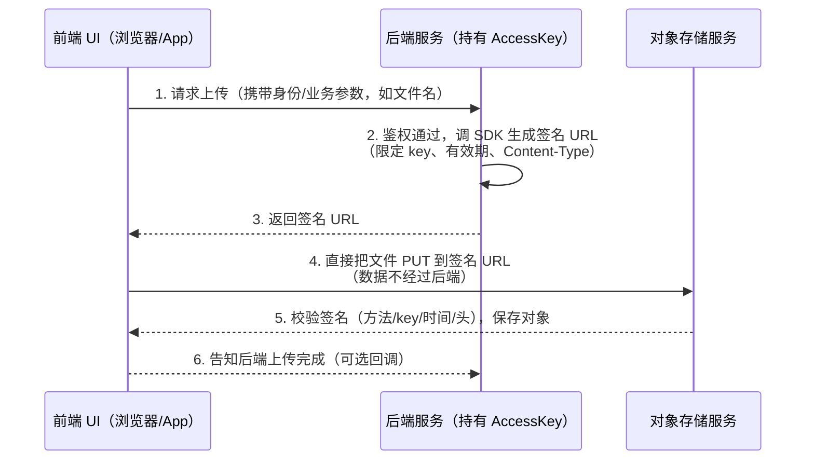
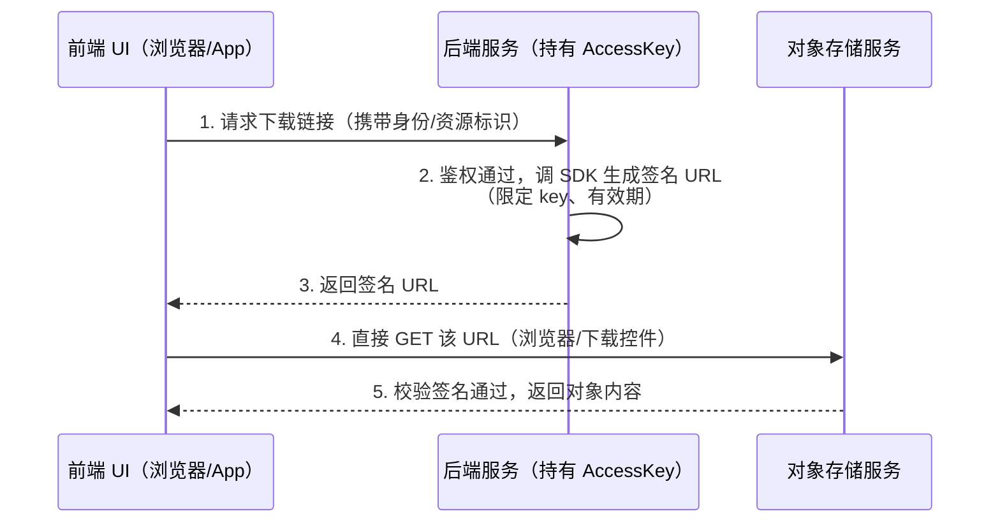

---
hide:
  - navigation
title: 对象存储签名 URL（Signed URL）原理与实战
tags:
  - knowledge
  - cloud
  - object-storage
  - signed-url
categories:
  - infrastructure
---

# 对象存储签名 URL（Signed URL）原理与实战

> 签名 URL（预签名 URL / Presigned URL）是对象存储的**通用能力**：AWS S3、
> 阿里云 OSS、Google Cloud Storage、MinIO 等均支持，机制同源。
> 本文以阿里云 OSS 为例讲透原理（来源：`prototypes/ali-oss-client` 原型实践
> 与 ali-oss 6.23.0 SDK 源码），各厂商的差异在文中单独标注。

## 概述

### 什么是签名 URL

签名 URL 把「在某个时间段内、对某个**指定对象**执行某个**指定操作**」的
权限，以查询参数的形式封装进 URL。持有 URL 的人在过期前即可完成该操作，
**无需提供 AccessKey**。

S3 的 Presigned URL、OSS 的签名 URL、GCS 的 Signed URL 是同一个概念。

### 什么情况下用签名 URL

一句话判断标准：**操作方不持有 AccessKey（Secret），但你希望给 TA 一个
临时、受限、可追溯的操作入口** —— 用签名 URL；否则不需要。

**需要签名 URL 的场景**

- **客户端直传（PUT）**：浏览器 / App 直接把文件上传到对象存储，文件
  **不经过你自己的服务器** —— 省服务器带宽、省时延、避免大文件上传把
  后端拖垮。前端不可能持有 Secret，只能由后端签发一个 PUT 签名 URL 给它。
- **限时下载（GET）**：给第三方一个临时下载链接 —— 限时分享、付费内容、
  私有 bucket 的受控访问。
- **表单直传 / 内容处理**：结合子资源参数（如 OSS 的 `x-oss-process`、
  S3 的响应头覆盖），把处理能力也封装进 URL。

**不需要签名 URL 的情况**

- **对象本身公开可读**（public-read / 公开 bucket）：直接访问静态 URL，
  无需任何签名。
- **操作方就是你自己的服务**：服务器之间直接用 SDK + `Authorization` 头
  操作，不必把权限塞进 URL。

### 请求流转过程（Flow）

签名 URL 的典型架构是 **后端签发、前端消费**：只有后端持有 AccessKey，
前端只持有 URL，数据流直接在客户端 ↔ 对象存储之间发生。

**上传流程（PUT 签名 URL，客户端直传）**



**下载流程（GET 签名 URL，限时访问）**



要点：**第 4、5 步不经过后端** —— 后端只做"签发"这一件轻活，大文件传输
发生在客户端与对象存储之间。

### Backend Server 与 Frontend UI 的隔离

核心原则：**签名 URL 是 AccessKey 能力的最小投影** —— 谁持有 Secret 谁
才能签发；谁持有 URL 谁只能按签名限定的方式使用，无法越权、无法伪造。

| 维度                          | Backend Server                                    | Frontend UI                                                         |
| ----------------------------- | ------------------------------------------------- | ------------------------------------------------------------------- |
| 持有 AccessKey（ID + Secret） | ✅ **唯一持有者**（环境变量 / 密钥管理服务）      | ❌ 永远拿不到                                                       |
| 职责                          | 身份鉴权 + 业务校验 + 用 SDK 签发签名 URL         | 拿 URL 直传 / 直下，展示进度与结果                                  |
| 能做什么                      | 签发任意对象、任意操作、任意时长的 URL            | 只能使用签发给它的**那一个** URL（一个 key、一个 method、一段时间） |
| 泄漏后果                      | Secret 泄漏 = 整桶沦陷（必须立刻吊销 / 轮换密钥） | URL 泄漏 = 该对象在有效期内暴露（范围可控、有期限）                 |

**职责边界（谁做什么）**

- **Backend**：身份鉴权 → 业务校验（文件名 / 大小 / 类型）→ 调 SDK
  签发（决定 key 范围、method、有效期、Content-Type）→ 返回 URL
- **Frontend**：携带身份请求 URL → 用 URL 直传 / 直下 → 处理结果
- **对象存储**：校验签名（方法 / 时间 / 资源 / 头）→ 执行操作

**隔离带来的好处**

- **数据流不经过后端**：上传 / 下载直接发生在客户端 ↔ 对象存储之间，
  服务器不转发大文件、不占带宽
- **权限按请求收敛**：每次签发都写死 key、method、有效期，前端无法借
  这个 URL 访问其他对象
- **Secret 不落地前端**：不进 JS bundle、不进浏览器、不进日志；URL 里
  只有 AccessKey ID + 签名（无 Secret），拿到 URL 也无法伪造新的签名或
  延长有效期

> 结合原型：`prototypes/ali-oss-client` 用单个 Node 脚本模拟 Backend
> （生成 URL），用 curl 模拟 Frontend（消费 URL）；真实架构中这两块代码
> 分别部署在服务端和客户端，二者之间只传递签名 URL，不传递任何密钥。
>
> 补充：浏览器直传 / 直读还需要给 bucket 配置 **CORS**（允许的来源、
> 方法与响应头），这是独立于签名本身的另一项配置。

## 基本原理

### URL 长什么样

签名 URL = 对象的基础访问 URL + 身份 / 过期时间 / 签名等查询参数。以
阿里云 OSS 的 V1 签名为例（虚拟主机风格，bucket 作为子域）：

```text
https://my-demo-bucket.oss-cn-hangzhou.aliyuncs.com/demo/hello.txt
  ?OSSAccessKeyId=LTAI5t...            # AccessKey ID
  &Expires=1717600000                  # 过期时间（Unix 秒），被签名、不可篡改
  &Signature=c2lnbmVkLXNpZ25hdHVyZQ==  # Base64(HMAC-SHA1(...))
```

不同厂商 / 版本的签名参数名不同，但**结构一致**：

| 厂商 / 版本          | 查询参数                                                                                                       |
| -------------------- | -------------------------------------------------------------------------------------------------------------- |
| AWS S3 SigV2（旧）   | `AWSAccessKeyId`、`Expires`、`Signature`                                                                       |
| 阿里云 OSS V1        | `OSSAccessKeyId`、`Expires`、`Signature`                                                                       |
| Google Cloud Storage | `GoogleAccessId`、`Expires`、`Signature`                                                                       |
| AWS S3 SigV4 / MinIO | `X-Amz-Algorithm`、`X-Amz-Credential`、`X-Amz-Date`、`X-Amz-Expires`、`X-Amz-SignedHeaders`、`X-Amz-Signature` |
| 阿里云 OSS V4        | `x-oss-credential`、`x-oss-date`、`x-oss-expires`、`x-oss-signature-version`、`x-oss-signature`                |

使用临时凭证（STS）签名时，还会额外带上凭证参数：S3 SigV4 为
`X-Amz-Security-Token`，OSS V4 为 `x-oss-security-token`。

共同点：都会把**凭证标识、过期时间、签名**放进 query；**过期时间本身被
签名**，因此无法通过修改 URL 延长有效期。

### 签名是怎么算出来的

核心原理（各厂商一致）：用 AccessKeySecret 对一份**规范化请求串**
（Canonical String / StringToSign）做 HMAC 计算，结果放进 URL；服务端用
同样的密钥重算比对，并校验当前时间早于过期时间。

以 OSS V1 为例（与 S3 SigV2 同构），ali-oss SDK 生成签名 URL 的调用：

```ts
const url = client.signatureUrl(key, { expires: 60, method: "GET" });
```

SDK 内部构造的三个查询参数（`signatureUrl()` 源码）：

```js
url.query = {
  OSSAccessKeyId: this.options.accessKeyId,
  Expires: expires,                 // 当前时间 + (options.expires || 1800)
  Signature: signRes.Signature
};
```

**StringToSign 的组成**（`buildCanonicalString` 按 `\n` 拼接）：

```text
METHOD                                  # 如 GET / PUT（大写）
<Content-MD5>                           # 没有则为空行
<Content-Type>                          # 没有则为空行
<Expires>                               # Unix 秒
<排序后的 x-oss-* 头>                   # 每行 key:value，可选（自定义头）
<CanonicalizedResource>                 # /bucket/object[?子资源]
```

`CanonicalizedResource` 即资源路径：`/${bucket}/${object}`，若带子资源
（如 `x-oss-process`）则追加 `?子资源`。

**Signature 计算**：

```js
Signature = Base64(HMAC-SHA1(AccessKeySecret, StringToSign))
```

**签名绑定了哪些要素**（改动任意一项 → 签名校验失败，如
`403 SignatureDoesNotMatch`）

- **HTTP 方法**（method，默认 GET）
- **对象 key**（体现在资源路径中）
- **Content-Type、Content-MD5**
- **自定义头**（如 OSS 的 `x-oss-*`、S3 的 `x-amz-*`）
- **子资源 / 查询参数**：内容处理（`x-oss-process`）、限速
  （`x-oss-traffic-limit`）、响应头覆盖（`response-*`）、临时凭证
  （`security-token` / STS）、回调（`callback`）等
- **过期时间 Expires**

### GET 签名 URL：限时下载

以 ali-oss 为例（S3 对应 `getSignedUrl` / `presignedUrl`）：

```ts
const url = client.signatureUrl(key, { expires: 60, method: "GET" });
```

- `method: "GET"` 是默认值，可省略
- 浏览器直接访问该 URL 即可下载对象，适合做临时分享链接

### PUT 签名 URL：限时上传（重点坑）

以 ali-oss 为例：

```ts
const url = client.signatureUrl(key, {
  expires: 60,
  method: "PUT",
  "Content-Type": "text/plain",   // 签名绑定了 Content-Type！
});
```

关键知识点：

- **任何人持有该 URL，在过期前都可以向这个 key 上传内容**（匿名写），
  相当于把「写」权限临时借了出去
- **签名绑定了 Content-Type**：上传请求必须发送生成 URL 时完全相同的
  `Content-Type`，否则校验失败（OSS / S3 均返回 `403 SignatureDoesNotMatch`）
- 其他请求头变更同样会使签名失配

端到端验证（原型 demo 打印的 PUT 签名 URL + GET 签名 URL）：

```bash
# 1. 保持 demo 对象不清理地运行一次，拿到打印的签名 URL
ALIYUN_OSS_KEEP_DEMO_OBJECT=true pnpm dev

# 2. 在过期前（demo 为 60s）用签名 URL 上传
curl -X PUT \
  -H "Content-Type: text/plain" \
  --data-binary "hello from curl" \
  "<signed upload URL>"

# 3. 用签名 GET URL 验证内容
curl "<signed GET URL>"
```

> 用 `--data-binary` 而不是 `--data`，避免 curl 自动去掉结尾换行。

## 其他细节

### 安全注意事项

- **持有即有权**：签名 URL 泄漏 = 对象在过期前暴露（或可被匿名写入）
- **有效期要短**：按业务场景设置（如 60 秒）；SDK 默认通常较长
  （如 OSS 默认 1800 秒）
- **PUT URL 意味着匿名写**：只对必要的 key 签发、给最短有效期
- **生产环境优先临时凭证 / 角色**（STS、IAM Role / RAM Role），避免长期
  AccessKey 常驻；权限按 bucket 收敛（最小权限）
- **过期时间不可延长**：过期时间被签名，篡改 URL 只会得到 403

### 常见错误排查

| 现象                                         | 原因                                                              |
| -------------------------------------------- | ----------------------------------------------------------------- |
| `403 SignatureDoesNotMatch`（OSS / S3 同名） | Content-Type / 请求头与签发时不一致；URL 被篡改                   |
| `403`（URL 已过期）                          | 当前时间超过过期时间（如 `RequestTimeTooSkewed`、`AccessDenied`） |
| 其他 `403`                                   | 权限不足、STS / 临时凭证过期                                      |

### 新一代签名（SigV4 / V4）

S3 SigV4 与 OSS V4 机制同源，都在逐步取代旧的 V1 / V2 签名：

- 查询参数不同：S3 为 `X-Amz-*`，OSS 为 `x-oss-*`
- 签名结构不同：基于 **Canonical Request**（方法 + 规范化 URI + 规范化
  查询串 + 规范化头 + 签名头列表 + Hashed Payload）+ 签名 scope
  （`date/region/service/aws4_request`），用 HMAC-SHA256 派生密钥后签名

旧版签名 URL 接口通常标记为 deprecated（如 ali-oss `signatureUrl` 在 7.x
弃用，改用 `signatureUrlV4`），新项目应优先使用新一代签名。

### 参考

- 本示例厂商文档：<https://help.aliyun.com/zh/oss/developer-reference/use-the-oss-node-js-sdk>
- 原型实践：[Prototypes 列表](../../../../../notes/prototypes.md#ali-oss-client) →
  `prototypes/ali-oss-client/`（源码在 GitHub 仓库，含 README 与 curl 测试步骤）
- SDK 源码（阅读入口，以 ali-oss 为例）：
  - `ali-oss/lib/common/object/signatureUrl.js`（V1 URL 生成）
  - `ali-oss/lib/common/object/signatureUrlV4.js`（V4 URL 生成）
  - `ali-oss/lib/common/signUtils.js`（StringToSign 构造与签名计算）
