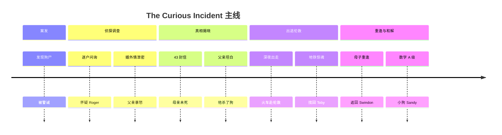

# 故事线

> 全书主线（简洁 list 版）见 [index.md](./index.md) 的「全书主线」一节。本页用 mermaid
> 时间线呈现六幕脉络；每幕的章节范围与关键事件见下方分幕明细。

## 分幕明细

- **第一幕 · 案发（ch 2–19）**: 深夜发现 Wellington 之死 → 被 Mrs. Shears 尖叫质问、
  警察到场 → 因被碰触而打警察 → 被带到警局，父亲深夜领回并获警诫。确立叙述设定：
  Christopher 的心智、质数章节、Toby、宇航员梦
- **第二幕 · 侦探调查（ch 23–113）**: 在父亲禁令下坚持调查——逐户问询邻居、用
  演绎链锁定 Prime Suspect = Roger Shears；Mrs. Alexander 透露 Judy 与 Roger 的婚外情；
  父亲两次暴怒（ch 79 许诺、ch 127 没收手稿并动手）；穿插大量数学/侦探方法论旁白
- **第三幕 · 真相揭晓（ch 127–163）**: Christopher 找回手稿失败，却在父亲卧室衬衫盒
  里发现 43 封母亲来信 → 母亲未死、与 Roger 私奔伦敦 Willesden；读信后崩溃呕吐；
  章末转入「心智」长论（Smarties / saccades / homunculus）
- **第四幕 · 坦白与出逃（ch 167–197）**: 父亲承认杀死 Wellington（红雾上头，ch 167）；
  Christopher 判定撒谎者不可信 → 深夜携 Toby 出逃、藏身花园 → 天亮后决定独自去伦敦
  投奔母亲 → 破窗取补给与父亲的银行卡 → 徒步到火车站
- **第五幕 · 伦敦历险（ch 199–227）**: 警察相助取钱买票后想把他带回父亲处 → 躲进行李
  架随车到 Paddington；地铁等车近 5 小时、Toby 掉下轨道被救；用 A-Z 找到 Chapter Road，
  深夜与母亲重逢
- **第六幕 · 重逢与和解（ch 227–233）**: 伦敦数日（父亲深夜闯来被警察带走）→ 母亲
  离开 Roger、驱车回 Swindon → Siobhan / Mrs. Gascoyne 重启 A-level（三天三卷，A 级）
  → 父亲以「5 分钟约定 + 小狗 Sandy」重建信任 → 结尾：further maths → 大学 → 科学家，
  「我能做任何事」

## 转折点

1. **母亲之死是谎言**（ch 149–157，发现信件）：家庭线反转，侦探对象从狗变成自己的
   身世；父亲第一次在 Christopher 眼中成为「不可信的人」
1. **凶手是父亲**（ch 167，坦白）：悬疑揭底的同时把威胁内化——「他能杀狗，就能杀我」，
   触发全书唯一的离家行动
1. **独行伦敦成功**（ch 197–227）：第一次独自穿越陌生世界并找到母亲——行动意义上的
   「我证明了自己」
1. **A 级成绩与信任项目**（ch 233）：父亲用定时器 5 分钟和 Sandy 把「信任」变成可
   执行的 project；Christopher 把未来重写为可计划的时间表（大学 → 科学家）
