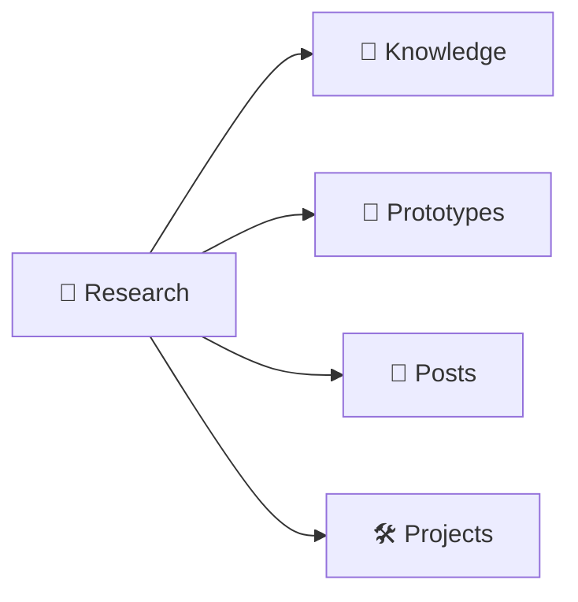

# :material-text-search: Research

日常阅读开源学习的笔记。

## Overview

| Topic                                      | Category                | Description                                     |
| ------------------------------------------ | ----------------------- | ----------------------------------------------- |
| [Lux](./topics/lux/)                       | Tools                   | Go 视频下载器，支持多个视频网站下载视频和音频   |
| [Redash](./topics/redash/)                 | Tools                   | 查询结果缓存机制与 Dashboard 自定义布局实现原理 |
| [trip](./topics/trip/)                     | Tools                   | TRIP 项目核心原理与代码阅读指南                 |
| [Rust](./topics/rust/)                     | Learning Plans          | 7 阶段学习路线图：基础语法到并发异步            |
| [English](./topics/english/)               | Learning Plans          | Hollow Knight 英语学习计划                      |
| [nest-commander](./topics/nest-commander/) | Libraries or Frameworks | NestJS CLI 构建工具                             |
| [Better Auth](./topics/better-auth/)       | Libraries or Frameworks | 源码阅读指南                                    |
| [NestJS](./topics/nestjs/)                 | Libraries or Frameworks | Module 注入原理与核心源码分析                   |
| [Jellyfin](./topics/jellyfin/)             | Libraries or Frameworks | 视频流播放原理与 Rust 最小原型                  |
| [shadcn/ui](./topics/shadcn-ui/)           | Libraries or Frameworks | CLI 工具源码阅读，Registry 组件分发系统         |

______________________________________________________________________

## Tools

- [lux](./topics/lux/)： Lux 是一个用 Go 编写的快速、简单的视频下载器，支持从多个视频网站下载视频和音频。
- [Redash](./topics/redash/)： Redash 源码阅读指南，查询结果缓存机制与 Dashboard 自定义布局实现原理
- [trip](./topics/trip/): TRIP 项目核心原理与代码阅读指南

## Learning Plans

- [Rust](./topics/rust/): Rust 学习计划 — 从基础语法到并发异步的 7 阶段路线图。
- [English](./topics/english/): Hollow Knight 英语学习计划 — 阅读、词汇、发音、Shadowing、口语、写作。

## Libraries or Frameworks

- [nest-commander](./topics/nest-commander/): 是一个为 NestJS 框架设计的 CLI (命令行界面) 构建工具。
- [Better Auth](./topics/better-auth/): Better Auth 源码阅读指南
- [NestJS](./topics/nestjs/): NestJS Module 注入原理与核心源码分析
- [Jellyfin](./topics/jellyfin/): Jellyfin 源码阅读指南，视频流播放原理与 Rust 最小原型
- [shadcn/ui](./topics/shadcn-ui/): shadcn/ui CLI 工具源码阅读指南，Registry 组件分发系统
