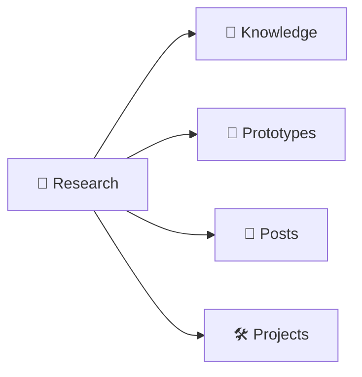

# :material-text-search: Research

日常阅读开源学习的笔记。

## Overview

| Topic                                    | Category                | Status    | Description                                    |
| ---------------------------------------- | ----------------------- | --------- | ---------------------------------------------- |
| [English](./topics/english/index.md)     | Learning Plans          | long-term | English Scraps 随手收集 + AI 归档；主题阅读    |
| [Protomaps](./topics/protomaps/index.md) | Libraries or Frameworks | polished  | PMTiles 自建底图：上海地区裁剪与 MapLibre 集成 |
| [DuckDB](./topics/duckdb/index.md)       | Libraries or Frameworks | polished  | 实战研究：环境/模拟数据/PostgreSQL 加速查询    |

> **Status**: `polished` — notes polished and ready to use; `long-term` — continuously maintained accumulation topics; `draft` — work in progress, may be removed.

### Drafts

> 仍在整理中的笔记，内容可能不完整，后续可能删除。

| Topic                                              | Category                | Status | Description                                     |
| -------------------------------------------------- | ----------------------- | ------ | ----------------------------------------------- |
| [Lux](./topics/lux/index.md)                       | Tools                   | draft  | Go 视频下载器，支持多个视频网站下载视频和音频   |
| [Redash](./topics/redash/index.md)                 | Tools                   | draft  | 查询结果缓存机制与 Dashboard 自定义布局实现原理 |
| [trip](./topics/trip/index.md)                     | Tools                   | draft  | TRIP 项目核心原理与代码阅读指南                 |
| [Rust](./topics/rust/index.md)                     | Learning Plans          | draft  | 7 阶段学习路线图：基础语法到并发异步            |
| [nest-commander](./topics/nest-commander/index.md) | Libraries or Frameworks | draft  | NestJS CLI 构建工具                             |
| [Better Auth](./topics/better-auth/index.md)       | Libraries or Frameworks | draft  | 源码阅读指南                                    |
| [NestJS](./topics/nestjs/index.md)                 | Libraries or Frameworks | draft  | Module 注入原理与核心源码分析                   |
| [Jellyfin](./topics/jellyfin/index.md)             | Libraries or Frameworks | draft  | 视频流播放原理与 Rust 最小原型                  |
| [shadcn/ui](./topics/shadcn-ui/index.md)           | Libraries or Frameworks | draft  | CLI 工具源码阅读，Registry 组件分发系统         |

______________________________________________________________________

## Tools

- [lux](./topics/lux/index.md)： Lux 是一个用 Go 编写的快速、简单的视频下载器，支持从多个视频网站下载视频和音频。
- [Redash](./topics/redash/index.md)： Redash 源码阅读指南，查询结果缓存机制与 Dashboard 自定义布局实现原理
- [trip](./topics/trip/index.md): TRIP 项目核心原理与代码阅读指南

## Learning Plans

- [Rust](./topics/rust/index.md): Rust 学习计划 — 从基础语法到并发异步的 7 阶段路线图。
- [English](./topics/english/index.md): English Scraps — 日常英语碎片（生词/语法/难句/搭配）随手收集 + AI 归档整理；特殊主题（如 Hollow Knight）阅读按需展开。

## Libraries or Frameworks

- [nest-commander](./topics/nest-commander/index.md): 是一个为 NestJS 框架设计的 CLI (命令行界面) 构建工具。
- [Better Auth](./topics/better-auth/index.md): Better Auth 源码阅读指南
- [NestJS](./topics/nestjs/index.md): NestJS Module 注入原理与核心源码分析
- [Jellyfin](./topics/jellyfin/index.md): Jellyfin 源码阅读指南，视频流播放原理与 Rust 最小原型
- [shadcn/ui](./topics/shadcn-ui/index.md): shadcn/ui CLI 工具源码阅读指南，Registry 组件分发系统
- [Protomaps](./topics/protomaps/index.md): PMTiles 自建底图研究 —— 上海地区底图裁剪、验证与 MapLibre 集成
- [DuckDB](./topics/duckdb/index.md): DuckDB 实战研究 —— 环境与基本使用、模拟数据构造、PostgreSQL 数据加速查询
