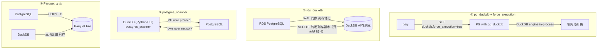
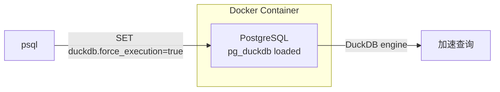
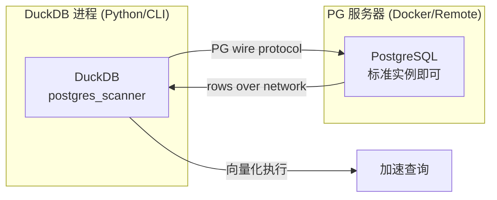
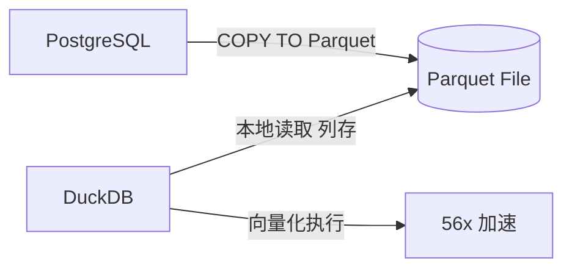

---
hide:
  - navigation
title: PostgreSQL 数据用 DuckDB 加速查询
tags:
  - research
  - tech
  - duckdb
  - postgresql
  - database
categories:
  - dev
---

# :material-speedometer: PostgreSQL 数据用 DuckDB 加速查询

> **本页目的：** 原始数据在 PostgreSQL 里，如何用 DuckDB 加速**分析型查询**
> （多表 JOIN + 聚合 + 窗口函数）。四种 DuckDB 扩展工作方式：
>
> 1. **pg_duckdb + force_execution** — PG 内部嵌入 DuckDB 引擎，零网络开销
> 1. **rds_duckdb** — 阿里云 RDS PostgreSQL 特供版，用同步的方式把表列存储化
> 1. **postgres_scanner** — DuckDB 外部连 PG
> 1. **Parquet 导出** — 格式转换后本地列存查询
>
> 附本机实测基准对比。数据源见 [模拟数据](./mock-data.md)，实验环境：
> MacBook（arm64）+ Docker 内 PostgreSQL 18.4，100 万订单 + 10 万客户。

### 选型对比

| 维度           | pg_duckdb + force_execution | rds_duckdb（Ali RDS 特供） | postgres_scanner        | Parquet 导出                 |
| -------------- | --------------------------- | -------------------------- | ----------------------- | ---------------------------- |
| **前提**       | PG 需安装 pg_duckdb 扩展    | 仅阿里云 RDS PostgreSQL    | 无（标准 PG 即可）      | 需 postgres_scanner 导出一步 |
| **网络开销**   | 零（同进程）                | 零（同进程 WAL 同步）      | 有（PG 线协议）         | 零（导出后解耦）             |
| **数据新鲜度** | 实时                        | WAL 增量同步，接近实时     | 实时                    | 取决于同步频率               |
| **复杂度**     | 低（一行 SET）              | 低（一行注册同步表）       | 低                      | 中（需导出流程/定时任务）    |
| **适合场景**   | 临时分析、对比验证、调试    | 阿里云生产库分析加速       | PG 受限环境、无法装扩展 | 生产报表、定时看板、归档     |



## 1. 思路：PG 扛 OLTP，DuckDB 扛 OLAP

PostgreSQL 是 **OLTP** 数据库（行存、事务、点查快）；分析型查询要扫全表 +
大 JOIN + 聚合，行存 + 网络往返都很吃亏。DuckDB 是进程内 **OLAP** 引擎
（列存、向量化、零网络开销），适合分析负载。

常见组合：PG 继续提供在线服务，分析/报表查询交给 DuckDB。

## 2. pg_duckdb + force_execution（PG 内嵌 DuckDB 引擎）

在 PG 内部加载 pg_duckdb 扩展，嵌入 DuckDB 执行引擎，
通过 `duckdb.force_execution` 切换当前会话的查询引擎。



### 2.1 前提：构建含 pg_duckdb 的 PG 镜像

用 [pglayers](https://github.com/pglayers/pglayers) 的预编译扩展层
（`ghcr.io/pglayers/pgx-*`）通过 multi-stage COPY 构建，无需源码编译。

**Dockerfile 核心**（完整文件见 `yaso/packages/database/Dockerfile.pgext`）：

```dockerfile
FROM postgres:18

# 自由组合所需扩展，每加一个就多一行 COPY
COPY --from=ghcr.io/pglayers/pgx-pg_duckdb:18  / /extensions/pg_duckdb/
COPY --from=ghcr.io/pglayers/pgx-pgvector:18   / /extensions/pgvector/

# 动态追加扩展路径到 PG 配置
RUN for ext in pg_duckdb pgvector; do \
      echo "extension_control_path = '/extensions/$ext/share:\$system'" \
        >> /usr/share/postgresql/postgresql.conf.sample; \
      echo "dynamic_library_path = '/extensions/$ext/lib:\$libdir'" \
        >> /usr/share/postgresql/postgresql.conf.sample; \
    done
```

**docker-compose.yml** 核心（完整文件见 `yaso/packages/database/docker-compose-pgext.yml`）：

```yaml
services:
  postgres-dev:
    build:
      context: .
      dockerfile: Dockerfile.pgext
    ports:
      - "5432:5432"
    environment:
      POSTGRES_USER: dev
      POSTGRES_PASSWORD: dev
      POSTGRES_DB: devdb
    command:
      - bash
      - -c
      - |
        exec docker-entrypoint.sh postgres \
          -c shared_preload_libraries=pg_duckdb,vector
```

**构建启动**：

```bash
docker compose -f docker-compose-pgext.yml up -d
```

### 2.2 创建扩展并验证

```sql
CREATE EXTENSION IF NOT EXISTS pg_duckdb;

-- 验证扩展已注册
SELECT * FROM pg_extension WHERE extname = 'pg_duckdb';

-- 验证 DuckDB 引擎可用
SELECT duckdb.query('SELECT version()');
```

### 2.3 测试 force_execution

```sql
-- 查看当前模式（默认 false）
SHOW duckdb.force_execution;

-- 切换到 DuckDB 引擎执行
SET duckdb.force_execution = true;
SELECT count(*) FROM orders WHERE order_date >= DATE '2026-06-01';

-- 切回 PG 原生引擎对比
SET duckdb.force_execution = false;
SELECT count(*) FROM orders WHERE order_date >= DATE '2026-06-01';
```

`duckdb.force_execution` 按会话设置，不持久化。分析会话中临时开启，
OLTP 写入保持 `false`。

> **注意：** 数据在 PG 本地，零网络开销，但受 PG 行存格式限制，
> 提速效果不如 Parquet 列存。

## 3. 阿里云 RDS 专用：rds_duckdb（WAL 同步列存副本）

> 阿里云 RDS PostgreSQL 内置的 DuckDB 分析加速插件 **rds_duckdb**，
> 与社区 pg_duckdb 定位类似。核心区别：
> **不是把查询临时转发给内嵌 DuckDB 引擎，而是先用「同步」的方式
> 把表列存储化** —— 在 DuckDB 侧维护一份列存副本，之后分析型查询
> 自动走列存副本加速。
>
> 官方文档：[使用 DuckDB 加速查询（阿里云 RDS）](https://help.aliyun.com/zh/rds/apsaradb-rds-for-postgresql/how-to-use-duckdb-to-speed-up-queries/)
>
> 以下实测均在 **rds_duckdb 1.5.1.2**（阿里云 RDS PostgreSQL）上完成。

### 3.1 rds_duckdb 与 pg_duckdb 的区别

| 维度     | pg_duckdb                  | rds_duckdb                                   |
| -------- | -------------------------- | -------------------------------------------- |
| 核心机制 | 查询路由到内嵌引擎实时执行 | 先**同步**生成 DuckDB **列存副本**，再走副本 |
| 数据形态 | 仍读 PG 行存               | DuckDB 列存（本地副本）                      |
| 同步机制 | 无，实时执行               | 基于 PG WAL / LSN 增量同步                   |
| 结构变更 | 实时生效                   | DDL 变更、drop table 按 LSN 自动处理         |
| 适用环境 | 自建 PG / 任意 PG          | 仅阿里云 RDS PostgreSQL                      |

### 3.2 创建扩展并检查

```sql
CREATE EXTENSION IF NOT EXISTS rds_duckdb;

-- 检查扩展是否注册
SELECT * FROM pg_extension WHERE extname = 'rds_duckdb';
```

psql 交互模式也可以直接 `\dx rds_duckdb` 查看。

### 3.3 注册同步表（把表列存储化）

先建好要加速的 PG 原表（如 `test_table`），再用
`rds_duckdb.create_duckdb_tables` 批量注册同步，
花括号内以**逗号分隔**多个表名：

```sql
SELECT rds_duckdb.create_duckdb_tables('{test_table,}');
```

> **DDL / drop 自动处理：** 注册后，PG 侧对表的 DDL 变更、
> 甚至 drop table，都会根据 PG **WAL 的 LSN** 自动同步处理，
> 无需手工重建 DuckDB 副本。

### 3.4 查看同步状态与延迟

```sql
SELECT sync_table,
       sync_status_description,
       confirmed_lsn,
       (SELECT pg_current_wal_lsn()) AS current_lsn,
       pg_wal_lsn_diff((SELECT pg_current_wal_lsn()), confirmed_lsn) AS lag_bytes
FROM rds_duckdb.duckdb_sync_stat;
```

- `confirmed_lsn`：DuckDB 副本已应用到的 WAL 位置
- `current_lsn`：当前 PG 的 WAL 位置
- `lag_bytes`：两者 WAL 距离，即增量同步落后的字节数
- `sync_status_description`：同步状态（syncing / not syncing 等）

> 官方文档还支持 `SET rds_duckdb.execution = on`（或语句级 Hint）
> 让 SELECT 显式走 DuckDB 执行，与 pg_duckdb 的 force_execution 类似；
> 本页未实测该开关，细节以官方文档为准。

## 4. postgres_scanner（DuckDB 外部连接 PG）

DuckDB 侧的扩展，从外部进程（Python/CLI）连接 PG 读取数据，
PG 端无需安装任何额外扩展，标准 PG 实例即可。



### 4.1 安装

```sql
INSTALL postgres_scanner;
LOAD postgres_scanner;
```

### 4.2 连接 PG

```sql
ATTACH 'dbname=devdb user=dev password=dev host=127.0.0.1 port=5432'
       AS pg (TYPE postgres);
```

### 4.3 查询

```sql
-- 像本地表一样查询
SELECT count(*) FROM pg.demo.orders WHERE order_date >= DATE '2026-06-01';

-- 多表 JOIN
SELECT city, count(*) AS n, round(sum(o.amount), 0) AS amt
FROM pg.demo.orders o
JOIN pg.demo.customers c ON o.customer_id = c.id
WHERE o.order_date >= DATE '2025-08-01'
GROUP BY city ORDER BY amt DESC LIMIT 5;
```

### 4.4 谓词下推验证

WHERE 条件会推到 PG 执行，只把过滤后的行拉回 DuckDB：

```sql
EXPLAIN SELECT count(*) FROM pg.demo.orders WHERE order_date >= DATE '2026-06-01';
```

```
┌─────────────┴─────────────┐
│       POSTGRES_SCAN       │
│       Table: orders       │
│          Filters:         │
│ order_date>='2026-06-01': │
│           :DATE           │
│       status='paid'       │
└───────────────────────────┘
```

### 4.5 写回 PG

```sql
CREATE OR REPLACE TABLE pg.demo.orders AS SELECT * FROM orders;
```

> **局限：** 大表数据经网络传输，JOIN 在 DuckDB 侧做，提速有限（约 1.8x）。
> 适合临时/adhoc 查询，不适合高频分析。

## 5. Parquet 导出

把 PG 表导出为 Parquet 列存格式，之后 DuckDB 本地查询，与 PG 完全解耦。



### 5.1 导出

```sql
-- 在 DuckDB 中执行
LOAD postgres_scanner;
ATTACH 'dbname=devdb user=dev password=dev host=127.0.0.1 port=5432'
       AS pg (TYPE postgres);

COPY pg.demo.orders TO 'parquet/orders.parquet' (FORMAT PARQUET);
```

本机实测：**100 万行导出耗时约 0.5 秒**，产出 14 MB 的 parquet 文件。

### 5.2 本地查询

```sql
-- 与 PG 完全解耦，零网络开销
SELECT city, count(*) AS n, round(sum(o.amount), 0) AS amt
FROM 'parquet/orders.parquet' o
JOIN 'parquet/customers.parquet' c ON o.customer_id = c.id
WHERE o.order_date >= DATE '2025-08-01'
GROUP BY city ORDER BY amt DESC LIMIT 5;
```

> **同步链路（可选）：** 定时任务增量导出（`WHERE updated_at > last_sync`），
> DuckDB 侧只读 parquet，长期为报表提供高速查询，不影响 PG 在线负载。

## 6. 基准对比（本机实测）

同一分析查询（orders JOIN customers，近一年按月/城市聚合 + 排序）：

| 执行方式                           | 耗时    | 相对 PG   |
| ---------------------------------- | ------- | --------- |
| PostgreSQL 直接执行                | 405ms   | 1.0x      |
| pg_duckdb force_execution          | 80.9ms  | **~5.0x** |
| DuckDB 直连 PG（postgres_scanner） | 112.4ms | ~3.6x     |
| DuckDB 查本地 Parquet              | 7.2ms   | **~56x**  |

结论：

- **force_execution** 快 5 倍 — DuckDB 引擎在 PG 进程内执行，零网络开销，不受 PG 行存限制
- **postgres_scanner** 快 3.6 倍 — 瓶颈是网络传输 + PG 侧扫描
- **Parquet** 快 56 倍 — 列存 + 向量化 + 无网络开销全面生效
- 结果一致：PG 与 DuckDB（Parquet）两端核对相同（78 个分组、总额 259,418,325.99）

> PG 侧没建索引，计划是并行 Seq Scan + 外部排序；对分析查询而言索引帮不上大忙。
> 数据量越大、查询越重，Parquet 路径优势越明显。

## 7. 实践建议

### 什么时候用哪个

| 场景                          | 推荐方式         | 原因                                 |
| ----------------------------- | ---------------- | ------------------------------------ |
| 临时 adhoc 分析、调试         | force_execution  | 一行 SET 开箱，零配置                |
| 对比验证 DuckDB 加速效果      | force_execution  | 同会话内 switch 对比，结果最直接     |
| 阿里云 RDS 生产库分析加速     | rds_duckdb       | WAL 同步列存副本，DDL/drop 自动处理  |
| PG 没装任何扩展、只能从外部连 | postgres_scanner | 唯一选项，PG 端无侵入                |
| 生产报表、定时看板            | Parquet 导出     | 56x 加速，与 PG 解耦，不影响在线负载 |
| 数据归档、长周期分析          | Parquet 导出     | 列存压缩，对象存储低成本             |

### 通用原则

1. **在线服务** → 继续用 PG（事务、点查、写入）
1. **快速探索** → 用 pg_duckdb + force_execution 在 PG 会话内测 DuckDB 加速效果
1. **阿里云 RDS 生产库** → 用 rds_duckdb 同步列存副本，DDL/drop 自动处理，省运维
1. **生产分析** → 导出 Parquet 后用 DuckDB 查询，或定时增量同步
1. **数据量更大时** → parquet 可放对象存储（R2/S3）配合 `httpfs` 扩展

## 8. 参考链接

| 资源                 | 链接                                                                                                                                                                                                   |
| -------------------- | ------------------------------------------------------------------------------------------------------------------------------------------------------------------------------------------------------ |
| 阿里云 RDS 官方文档  | [https://help.aliyun.com/zh/rds/apsaradb-rds-for-postgresql/how-to-use-duckdb-to-speed-up-queries/](https://help.aliyun.com/zh/rds/apsaradb-rds-for-postgresql/how-to-use-duckdb-to-speed-up-queries/) |
| DuckDB Postgres 扩展 | [https://duckdb.org/docs/stable/core_extensions/postgres](https://duckdb.org/docs/stable/core_extensions/postgres)                                                                                     |
| Parquet 扩展         | [https://duckdb.org/docs/stable/core_extensions/parquet](https://duckdb.org/docs/stable/core_extensions/parquet)                                                                                       |
| pg_duckdb            | [https://github.com/duckdb/pg_duckdb](https://github.com/duckdb/pg_duckdb)                                                                                                                             |
| pglayers             | [https://github.com/pglayers/pglayers](https://github.com/pglayers/pglayers)                                                                                                                           |
| httpfs               | [https://duckdb.org/docs/stable/core_extensions/httpfs](https://duckdb.org/docs/stable/core_extensions/httpfs)                                                                                         |

→ 返回目录：[DuckDB 实战研究](./index.md)
