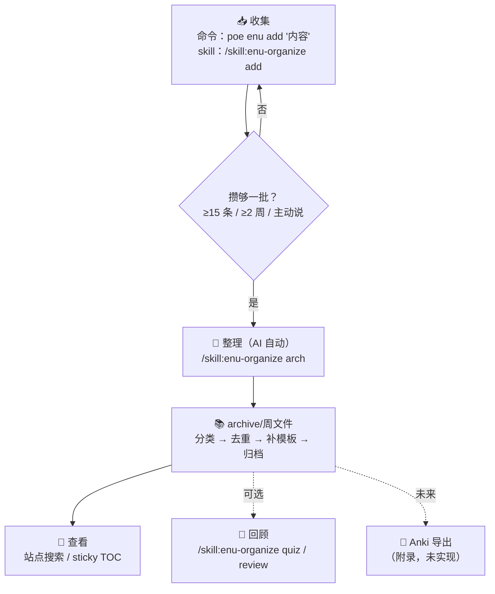

---
hide:
  - navigation
title: English Scraps 使用指南
tags:
  - research
  - tech
  - english
  - scraps
categories:
  - dev
---

# English Scraps — 使用指南

> 本页是本计划的入口：首次使用先看这里，日常疑问回这里查。

## 使用流程

## 步骤说明

| 步骤           | 操作（命令 / 说话）                                | 触发条件                      | 文档位置                                               |
| -------------- | -------------------------------------------------- | ----------------------------- | ------------------------------------------------------ |
| ① 收集         | `poe enu add "内容"` 或 `/skill:enu-organize add`  | 随时，几秒                    | 本页「收集」；`poe enu add --help`                     |
| ② 整理         | `/skill:enu-organize arch`                         | inbox ≥ 15 条 / ≥ 2 周 / 主动 | `.pi/skills/enu-organize/SKILL.md`（skill 即流程文档） |
| ③ 查看         | 打开本站[归档索引](./archive/)                     | 任何时间                      | archive/index.md 周列表 + 字段说明                     |
| ④ 回顾         | `/skill:enu-organize quiz [范围]` / `review <tag>` | 按需                          | 本页「回顾」                                           |
| ⑤ Anki（未来） | 说「导出到 Anki」                                  | 主线稳定后                    | 计划 Anki 附录（未实现）                               |

## 收集

- **主渠道**：`uv run poe enu add "内容"` —— 自动加当天日期前缀，追加到
  `inbox.md`（`--date YYYY-MM-DD` 可回溯）
- **pi 对话（skill）**：`/skill:enu-organize add xxx`，AI 追加一行 `YYYY-MM-DD xxx` 到 inbox
- **兜底**：直接编辑 `inbox.md` 追加一行（一行一条，日期前缀可选，
  不写日期也行，AI 整理时记为整理当日）

## 整理

攒够一批后（inbox ≥ 15 条 / 距离上次整理 ≥ 2 周 / 主动），
用 `/skill:enu-organize arch` 触发，AI 按 `.pi/skills/enu-organize/SKILL.md` 的流程执行：

> skill 的 description 保持简短（不占用常驻 AI context），触发词与完整流程
> 在 skill 正文；`/skill:enu-organize <action>`（add / arch / quiz / review）
> 加载后按正文执行。

分类（type 判定）→ 去重（`type:关键词`）→ 按模板补全 → 按条目日期所在 ISO 周写入
[archive/](./archive/)（每张卡落进对应周文件，如 `2026-w33.md`）→ 清空
inbox 已处理条目 → 更新本页「上次整理」与归档周列表 → 汇报存疑项
（misc / 来源未知 / 疑似重复），只审这些即可。

## 归档

- **上次整理**：2026-08-12
- 归档按 **ISO 周**分文件：`scraps/archive/<YYYY-www>.md`（如 `2026-w33.md`），卡片
  按 `date` 落进对应周文件；只在有归档的周生成，不强制每周都有；周列表见
  [归档索引](./archive/)
- 所有知识点统一用 `type` + `tags` 区分；单词类卡片含中文「含义」+ **英英释义「英义」**，
  可加选填「记忆」（词根/词源/助记，简单词不用）
- `type` 分类：`word` / `phrasal-verb` / `collocation` / `idiom` / `grammar` /
  `sentence` / `misc`
- 查找靠站内全文搜索

## 回顾

- **quiz（出题）**：`/skill:enu-organize quiz [范围]` —— AI 出 5–10 题并批改
  （默认最近一批；可加范围：`<tag>` / `最近 N 条` / `全部`）
- **review（复习）**：`/skill:enu-organize review <tag>` —— AI 先扫 archive
  现有 tags 给出可选项，再筛出卡片列表
