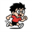

# :material-flask: Projects

从收集知识到深入研究再到动手产出的成果汇总。

______________________________________________________________________

## 🟢 Active

### seedling

React 写的 Dashboard Demo UI，支持多语言、多皮肤模式，用来整理日常开发的组件原型。

- :simple-github: [Source](https://github.com/xiongjia/seedling)
- :material-web: [Demo](https://xiongjia.github.io/seedling/)
- :material-file-document: [Docs](https://xiongjia.github.io/seedling/docs/)

**Pipeline**: Collection(frontend) → Research(shadcn/ui CLI) → Side Project

______________________________________________________________________

## 📦 Archived

### Running Otaku

 用来同步展示自己 Garmin 手表的跑步数据。
基于 [@yihong0618](https://github.com/yihong0618) 的 [Running Page](https://github.com/yihong0618/running_page)。

- :simple-github: [Source](https://github.com/xiongjia/running_page)
- :material-web: [Demo](https://xiongjia.github.io/running_page/)
