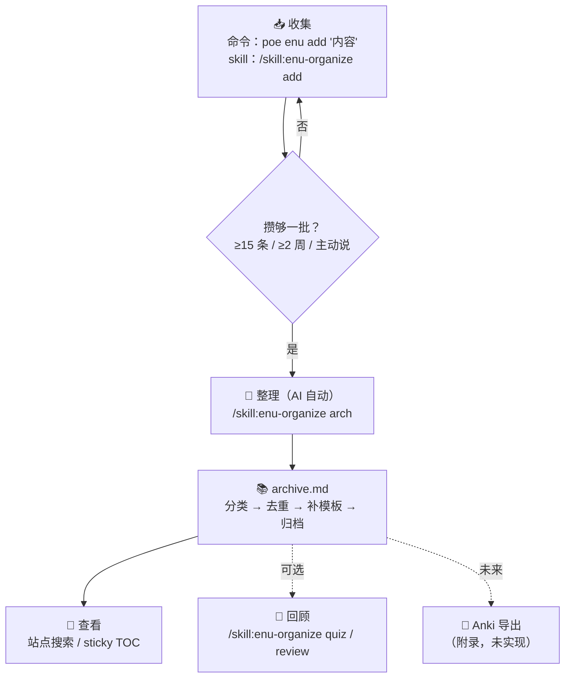

# 英语学习随手收集 + AI 归档计划（English Scraps）

## 一句话

日常随手遇到的英语知识（生词、语法点、难句、词语搭配等）**随时收集**，攒够一批后由 AI
**整理成归档笔记**，融入现有英语学习知识库 `docs/notes/research/topics/english/`。

## 目标

- **低摩擦收集**：遇到不懂的英语表达，几秒钟记下，不打断当前阅读/工作
- **AI 整理归档**：AI 负责分类、查证、补全模板、去重、写入归档，人只做最终确认
- **沉淀为长期资产**：归档内容与 HK 学习计划共用知识库，供日后复习与回顾引用
- **贴合实际节奏**：HK 计划的「主题制、每天固定 30–45 分钟」对用户不可行；
  本计划定位为**轻量替代路径** —— 碎片化、随时发生、攒够一批再让 AI 整理，
  不需要任何固定时间投入

## 背景与现状

- 已有 `internal/plans/hollow-knight-english-learning.md`：主题制英语学习
  （Reading / Vocabulary / Pronunciation / Shadowing / Speaking / Writing）——
  但「每天固定 30–45 分钟」的节奏用户做不到，实际难以坚持；其发音 / 词汇 / 周复盘
  等页面已移除，英语主题现为 scraps 主路径 + 主题列表（见 `english/index.md`）
- **本计划的定位**：不是 HK 的补充，而是更贴合用户实际（碎片化、零时间成本）
  的主要学习路径；主题阅读（HK 等）想做就做，不做也不影响 scraps 积累
- **缺口**：日常阅读技术文档、看视频、刷网页时遇到的生词/难句没有入口；
  随手记在别处的内容没有系统整理，容易丢失
- 本计划补上「**收集 → 整理 → 归档**」这条流水线

## 核心工作流

```text
随手收集 ──> inbox（暂存）──> AI 批量整理 ──> 统一归档 ──> Anki 导出复习（可选）
   (几秒)       (单一文件)     (攒够一批后)    (archive.md)   (仅当用户要时)
```

## 收集渠道（随时）

1. **收集命令（主渠道）**：`uv run poe enu add "内容"` —— 模仿
   `poe create-post` 的脚本，自动加当天日期前缀并追加到
   `docs/notes/research/topics/english/scraps/inbox.md`（规格见「工具链与约定」）；
   GitHub 手机 App 直接改 inbox.md 作为兜底
1. **pi 对话直接记录（skill）**：`/skill:enu-organize add xxx`，AI 追加一行
   `YYYY-MM-DD xxx` 到 inbox（或确认后直接归档）
1. **Moment（可选）**：`poe create-moment` 适合打卡/心得，不适合放原始学习碎片
   —— Moment 是公开时间轴，碎片先走 inbox
1. **未来扩展**：Telegram bot / 浏览器插件 / 快捷指令（写入手机本地文件再同步）
   —— 本期不做，留作长期想法

## 内容位置

```text
docs/notes/research/topics/english/
├── index.md                  # 英语学习入口：scraps 主路径 + 特殊主题列表
└── scraps/                   # 本计划的收集与归档区
    ├── index.md              # 归档说明 + 上次整理时间（AI 指令在 skill 里）
    ├── inbox.md              # 📥 收集收件箱（原始碎片，draft: true）
    └── archive.md            # 统一归档文件（所有知识点在一个文件）
```

- **单一归档文件**：所有知识点统一写入 `archive.md`，用 `type` + `tags` 区分，
  不按时间 / 类别拆分子文件，告别「不知道去哪找」的问题
- **archive 模板独立**：英语主题下 HK 阅读页各为主题独立体系，archive 卡片字段
  不复用其他页字段，避免混淆
- 归档文件遵循 research 约定：`title` / `tags` / `categories` frontmatter、
  mdformat 兼容、页面间相对链接

## scraps/index.md「如何使用」入口页

> index.md 是本计划的**使用入口**：首次使用先看这里，日常疑问回这里查。
> 页面内容 = 一个 mermaid 使用流程（顶部）+ 步骤说明表 + 归档说明 + 「上次整理」字段。

### 使用流程（mermaid，放页面顶部）



### 步骤说明表（每个步骤：操作 / 触发 / 文档位置）

| 步骤           | 操作（命令 / 说话）                                | 触发条件                      | 文档位置                                                             |
| -------------- | -------------------------------------------------- | ----------------------------- | -------------------------------------------------------------------- |
| ① 收集         | `poe enu add "内容"` 或 `/skill:enu-organize add`  | 随时，几秒                    | 本页「收集」；`poe enu add --help`                                   |
| ② 整理         | `/skill:enu-organize arch`                         | inbox ≥ 15 条 / ≥ 2 周 / 主动 | `.pi/skills/enu-organize/SKILL.md`（skill 即流程文档）；本页「整理」 |
| ③ 查看         | 打开站点 archive.md 页                             | 任何时间                      | archive.md 顶部「字段说明」                                          |
| ④ 回顾         | `/skill:enu-organize quiz [范围]` / `review <tag>` | 按需                          | 本页「回顾」                                                         |
| ⑤ Anki（未来） | 说「导出到 Anki」                                  | 主线稳定后                    | 计划 Anki 附录（未实现）                                             |

> **文档位置原则**：skill 文件本身即完整流程文档（SKILL.md 写全步骤）；页面只放
> 速查表和入口，不重复维护两份流程，避免漂移。

## 分类体系（type 标签，不决定文件位置）

归档文件内每条知识点用 `type` 和 `tags` 标记，AI 自动判定，**不拆分到不同文件**。

| `type` 标签    | 含义                        | 示例                                    |
| -------------- | --------------------------- | --------------------------------------- |
| `word`         | 单个词 / 复合词（含连字符） | `cumbersome`, `state-of-the-art`        |
| `phrasal-verb` | 短语动词                    | `come up with`, `look forward to`       |
| `collocation`  | 词语搭配 / 名词-形容词组合  | `heavy rain`, `cutting-edge technology` |
| `idiom`        | 习语 / 地道表达             | `by and large`, `kick the bucket`       |
| `grammar`      | 语法点、语法疑问            | `would have done`, `present perfect`    |
| `sentence`     | 读不懂的长难句              | 完整句子，需结构拆解                    |
| `misc`         | 无法判定的兜底              | —                                       |

**判定规则**（给 AI 的简化指令）：

- 单个词或复合词（词典有独立词条）→ `word`
- 动词 + 介词/副词组合（整体含义≠字面叠加）→ `phrasal-verb`
- 名词/形容词的习惯搭配 → `collocation`
- 固定习语（含义不可拆分）→ `idiom`
- 涉及时态、语态、从句、虚拟语气等规则 → `grammar`
- 完整句子需拆解 → `sentence`
- 无法判定 → `misc` + 备注说明

## Inbox 格式（低摩擦）

```markdown
<!-- 追加即记；一行一条，日期前缀便于排序；AI 自动分类，无需写类型前缀 -->
2026-08-08 cumbersome
2026-08-08 The implementation is cumbersome to maintain.
2026-08-09 为什么这里用 would have done 而不是 would do？
2026-08-09 come up with
2026-08-10 看 arXiv 摘要时遇到：state-of-the-art vs cutting-edge 区别
```

- 纯文本、无 checkbox：AI 归档后**直接从 inbox 删除**已处理条目（信息已完整保留在
  归档卡片里，不保留已处理记录 —— 减少维护负担）

- **无日期兜底**：命令 / `add` 自动带日期；粘贴或手写的行若没日期，AI 整理时
  记为整理当日，并在汇报里列出确认

- **来源不强制**：随手记不写来源，AI 整理时来源未知就标「未知来源」，必要时
  询问用户（绝不编造来源）

- inbox.md 完整 frontmatter（不上生产，title 仅本地 `poe server` 显示）：

  ```yaml
  ---
  draft: true
  title: English Scraps Inbox
  ---
  ```

  本地 `poe server` 可见、生产构建自动过滤（见 `plugins/draft_filter.py`），
  但**仍随 git 提交**以便跨设备同步

## AI 整理流程（固定步骤，触发式）

触发条件（满足任一即可整理，不用纠结「够不够多」）：

- **条数**：inbox.md 行数 ≥ 15 条
- **时间**：距离上次整理 ≥ 2 周（上次整理时间记录在 `scraps/index.md`，防止遗忘）
- **主动**：`/skill:enu-organize arch`（或说「整理一下 scraps」）

1. 读取 inbox 中全部条目
1. 逐条判定 `type`（`word` / `phrasal-verb` / `collocation` / `idiom` / `grammar` /
   `sentence`），无法判定的归入 `type: misc`，加备注
1. **去重**：在 `archive.md` 中搜索 `### <关键词>`：
   - 存在 → 在原有条目下追加「新语境」和「新来源」（保留原有 `status`，不覆盖）
   - 不存在 → 在文件末尾新建条目，`status: new`
1. 按模板补全（查 IPA / 词性 / 词典义 / 例句；难句做结构拆解；语法点给规则 +
   例句 + 易错点）；来源未知标「未知来源」
1. 写入 `scraps/archive.md`（追加到文件末尾；写入前若行数 > 5000，先按
   「超长处理」归档旧文件；**不维护文件顶部的实时条目索引**，靠站内全文搜索 +
   backlinks 插件查找）
1. **归档后删除**：从 inbox 删除已处理条目（不保留、不建处理日志）
1. 更新 `scraps/index.md` 的「上次整理」日期（手动整理 archive 后也应更新）
1. 向用户汇报：本次归档 N 条（按 type 分组），待确认清单

### 去重规则

- **去重 key = `type:关键词`**（如 `phrasal-verb:come-up-with`），不只按关键词——
  避免同一表达被判成不同 type 时重复建卡（`come up with` 可被判 phrasal-verb 或
  idiom）
- **关键词规范化**：小写化、空格变连字符（`come up with` → `come-up-with`）
- **拼写变体**：`state of the art` / `state-of-the-art`、英/美拼写（`colour`/`color`）
  等变体，AI 判定为同一表达时合并建卡，并在卡片里记录别名
- **搜索范围**：仅在 `archive.md` 内搜索 `### <关键词>`，无需跨文件扫描
- **跨主题边界**：与 HK 主题词汇（`hollow-knight/` 各页）
  **不强制互查** —— 两套体系语境不同、查询入口不同，重复建卡成本低；但 AI 整理
  word 卡时若记得 HK 词汇里见过，可加 `related: hollow-knight/...` 引用链接，
  不合并。试点后看实际重复率再决定是否跨查
- **重复处理**：追加新语境，不新建卡片；跨时间重复问题天然消失
- **同词不同词性**：`run` 作 v. / n. 默认合并进同一张卡（不同含义用多个「含义」
  条目）；想拆开时手动拆（纠错机制允许手改）

## 归档模板（archive.md 内条目格式）

```markdown
---
hide:
  - navigation
title: English Scraps Archive
tags: [english, archive]
categories: [dev]
---

### cumbersome

- **type**: word
- **date**: 2026-08-08
- **source**: 技术文档（Kubernetes 官方文档）｜未知来源
- **status**: new
- **tags**: [technical, adjective]
- **发音**: /ˈkʌmbəsəm/
- **含义**: 笨重的；繁琐的
- **语境**: 指代码实现难以维护
- **原句**: The implementation is cumbersome to maintain.
- **造句**: ...
- **同义/反义**: unwieldy / handy

### come up with

- **type**: phrasal-verb
- **date**: 2026-08-09
- **source**: 未知来源
- **status**: new
- **tags**: [informal, idea]
- **含义**: 想出（主意/方案）
- **例句**: ...
- **替换**: think of / devise

### would have done

- **type**: grammar
- **date**: 2026-08-09
- **source**: 未知来源
- **status**: new
- **tags**: [conditional, perfect]
- **规则**: 表与过去事实相反的虚拟语气
- **例句**: ...
- **易错点**: 与 would do 的区别

### The implementation is cumbersome to maintain

- **type**: sentence
- **date**: 2026-08-08
- **source**: 未知来源
- **status**: new
- **tags**: [technical]
- **结构拆解**: 主语(The implementation) + 系动词(is) + 表语(cumbersome) + 不定式(to maintain)
- **翻译**: 这个实现方式维护起来很繁琐。
- **难点**: 形容词后接不定式作状语
- **仿写**: The API is intuitive to use.
```

**`###` 标题规则**：

- `word` / `phrasal-verb` / `collocation` / `idiom` / `grammar`：标题 = 关键词
  本身（如 `cumbersome`、`come up with`、`would have done`）
- `sentence`：标题截断加省略号（如 `### The implementation is cumbersome to...`）；
  去重 key 仍用规范化后的完整句首词串

**字段说明**：

- `status`: `new`（刚归档）/ `learning`（已导出 Anki）/ `mastered`（已掌握）——
  导出到 Anki 才会流转，不导出就一直是 `new`，不影响归档使用
- `source`: 记录来源（**可含 URL**，便于用户复核 AI 释义）；inbox 不强制记，
  AI 整理时未知标「未知来源」
- `tags`: 从**固定词表**提取（technical / informal / formal / adjective / verb /
  idiom 等，英文小写，可扩充），避免 tag 太自由导致 `review <tag>` 筛不到；
  难度（easy / medium / hard）不设独立字段，需要时作为 tag 加
- 其余字段按 `type` 选填：`word` 有发音/含义/语境/原句/造句/同义反义；
  `phrasal-verb` / `collocation` / `idiom` 有含义/例句/替换；`grammar` 有规则/
  例句/易错点；`sentence` 有结构拆解/翻译/难点/仿写

## 索引与查找

- **不做实时条目索引**：archive.md 顶部不维护「条目索引」列表（避免每次整理的
  编辑热点和 git 冲突）
- 查找靠：站内全文搜索（MkDocs `search` 插件）+ backlinks 插件互链
- `scraps/index.md` 记录「上次整理：YYYY-MM-DD」，作为触发条件（≥ 2 周）的
  可观测依据；**手动编辑 archive 后也应更新该字段**
- **archive 可用性**：搜索靠全文搜索，试点时实测 `###` 条目可命中；backlinks
  基于页面间链接，单文件内锚点可能不产生反向链接，**不依赖它**；archive.md
  frontmatter 加 `hide: navigation`，长页面靠 Material 右侧 sticky TOC；
  5000 行内渲染无压力

## 并发约定

- AI **从不主动整理**，只在用户触发时整理
- 整理前检查「上次整理」时间，若当天已整理过则提醒「今天已整理过，确定再整？」
- 不做锁 / 标记文件（过度设计）

## 纠错与修正

- AI 整理产出是**建议稿**：汇报时只列「存疑项」（misc 条目 / 来源未知 / 疑似可合并
  重复 / 释义不确定），用户只审这些，无需逐条确认
- archive.md 用户可随时手改；AI 下次整理前先读 archive，**尊重已有内容**——不覆盖、
  不「纠正」用户改过的地方
- 改 `type` 时同步改 `###` 标题（去重 key 含 type），必要时加 `alias` 备注防重复
- 不建修正日志——git 历史就是日志

## 回顾（按需触发，不设独立触发器）

- **整理完成时（被动）**：AI 汇报附「批次摘要」（word × 5 / grammar × 2 …），
  扫一眼 = 最小回顾，零额外动作

- **主动触发**：`/skill:enu-organize quiz [范围]` → AI 出 5–10 题（英译中/中译英/填空）
  并批改；`/skill:enu-organize review <tag>` → AI 先扫 archive.md 现有 tags
  给出可选项，再筛出列出

  `quiz` 范围参数（可选，缺省 = 最近一次整理的那批）：

  - `quiz` → 最近一批（默认，刚学的先测）
  - `quiz <tag>` → 指定 tag（如 `quiz technical`）
  - `quiz 最近 N 条` → 最近 N 条
  - `quiz 全部` → 整个 archive（每次仍只出 5–10 题）

- 不做任何定期回顾（daily/weekly 都做不到，定期触发器必然失效）

## Anki 导出（可选附录，先不做）

> 复习完全可选：archive.md 才是知识库本体，不导出 Anki 也能正常使用。
> 本计划**主线先跑通「收集 → 归档」**，Anki 作为可选工具；以下设计留作
> 后续扩展，不列入前期 Tasks。

- **触发**：用户说「导出到 Anki」或「生成 Anki 卡片」
- **筛选**：只导出 `status: new` 的条目（或用户指定 tag / type）
- **卡片模板**：每 `type` 一个 Anki note type（避免跨类型撞名），正反面映射：

| type           | Anki 正面                | Anki 背面                  |
| -------------- | ------------------------ | -------------------------- |
| `word`         | `cumbersome` /ˈkʌmbəsəm/ | 含义 + 语境 + 原句 + 造句  |
| `phrasal-verb` | `come up with`           | 含义 + 例句 + 替换表达     |
| `collocation`  | `heavy rain`             | 含义 + 例句 + 对比搭配     |
| `idiom`        | `by and large`           | 含义 + 来源 + 例句         |
| `grammar`      | 例句（挖空或标红）       | 规则 + 易错点 + 对比       |
| `sentence`     | 原句                     | 结构拆解 + 翻译 + 仿写提示 |

- **输出格式**：
  - CSV：每 type 一个文件，列映射明确（正面, 背面, tags, source），tags 用
    `#tag` 语法或导入时设置；CSV 用 **UTF-8 with BOM**（Windows/Excel 兼容）；
    导入勾选 "Update existing notes when first field
    matches"（第一字段 = 该 type 的去重 key，天然去重）
  - AnkiConnect：先 `canAddNotes` 过滤再 `addNotes` 批量写入（本地 API）
- **导出后**：把对应条目 `status: new` 改为 `status: learning`
- **状态流转**：`new → learning → mastered` 单向；`mastered` 由用户手动改
  `status`，不做 Anki→archive 自动回写（边界：Anki 里删卡/改卡不回写 archive）
- **去重控制**：归档时去重（`type:关键词` key）+ 导出筛选 `status: new` +
  Anki 导入 update-existing，三层兜底

## 与现有体系衔接

- **index.md dashboard**：增加「随手收集」说明 —— 平时遇到就记 1–2 条到
  inbox（几秒钟，不绑定任何每日额度）
- **HK 主题页**：hollow-knight/ 各页按主题模板记录，archive 卡片模板不复用其字段
  （两套并存，各自说明自己的字段）
- **周复盘完全解耦**：不绑定任何周期回顾；回顾方式灵活（如攒一批后
  集中看一遍 archive，或按 tag 筛选）

## 工具链与约定

- `draft: true`：仅 inbox.md 使用（草稿态、本地可见、不上生产）
- frontmatter：归档文件必须含 `title` / `tags` / `categories`
- 格式：mdformat 兼容（`poe fmt` 会格式化 docs/）
- 链接：相对链接（如 `./scraps/archive.md`）
- AI 整理指令做成 **pi skill**：`.pi/skills/enu-organize/SKILL.md` ——
  **description 保持简短**（不枚举触发词，避免常驻 AI context），动作词表
  （add / arch / quiz / review）与完整流程在正文（skill 加载后即得）；
  触发用 `/skill:enu-organize <action>`；命名用 `enu-` 前缀 —— 未来其他领域
  的整理（如读书笔记）各建各的 skill，互不干扰
- **收集命令**：`poe enu add "内容"` —— 模仿 `poe bucket-sync pull` 的
  「命名空间 + 子命令」模式（`scripts/enu.py`，子命令 `add`，后续可扩展 `list`
  等）—— 追加一行 `YYYY-MM-DD <内容>` 到 `scraps/inbox.md`（自动建目录/文件，
  可选 `--date` 回溯）；**纯脚本，无 AI 依赖**（与 `poe create-post` 一致）

## Tasks

### 搭建

- [x] 建立 `scraps/` 结构（index.md / inbox.md / archive.md）
- [x] 建 `scripts/enu.py` + poe task `enu`，子命令 `add`（追加 `YYYY-MM-DD <内容>` 到 inbox.md）
- [x] `inbox.md` 加 `draft: true`，写清收集格式说明
- [x] `scraps/index.md` 写「如何使用」入口页（mermaid 流程 + 步骤表 + 归档说明 + 「上次整理」字段）
- [x] `docs/notes/research/topics/english/index.md` 增加「随手收集」入口与说明

### 整理流水线

- [x] 建 `.pi/skills/enu-organize/SKILL.md`（触发词 + type 判定 + 去重 key +
  条目模板 + 整理 8 步）
- [ ] 试点整理第一批 inbox 条目（等 inbox 有真实条目后验证 8 步流程）
- [x] 验证 archive.md 渲染效果（生产构建已生成 scraps 页面）
- [ ] 去重规则实操验证（跨时间重复、拼写变体、跨 type 撞名三个场景）
- [ ] 来源未知场景验证（不编造来源、必要时询问用户）

### 试点验收标准（达到 a+b+d 即视为方向明确，可进入正式执行）

- **a) 摩擦度**：连续 2 次整理，用户无需手改 AI 输出超过 2 处
- **b) 习惯**：inbox 平均每周新增 ≥ 2 条（收集习惯建立）
- **c) 质量**：存疑项比例 < 20%（AI 分类/释义准确度）；不达标则调整判定规则/模板
- **d) 可用性**：抽查 3 张卡能从站内搜索命中（不依赖 backlinks）

### 试点与收尾

- [ ] 实际使用一段时间（真实收集 + 按需 AI 整理），记录摩擦点
- [ ] 根据试点调整：分类粒度、标签体系、触发时机、archive.md 拆分阈值
- [ ] （可选）Anki 导出模板验证（CSV 导入测试）—— 主线稳定后再做

## Notes / 开放问题

- **命名**：用户确认目录叫 `scraps/`（不用 daily，也不用 capture）；节奏按需触发
  （攒够一批 / 想整理了就整理），不绑定每日或每周
- **单一归档文件**：`archive.md` 一个文件收全部，用 `type` + `tags` 区分，
  不按时间/类别拆子文件，避免「不知道去哪找」；与知识库原约定「每个知识点
  一个文件」冲突，本计划以「查找方便」优先
- **超长处理（已定）**：archive.md 超过 5000 行时，整理时把当前文件重命名为
  `archive-YYYY-MM-DD.md`（带归档日期），新建空 archive.md 继续 —— 去重仍只在
  当前 archive.md 内搜索，跨归档重复不再合并（旧卡片已过时，可接受）；需要时
  手动查旧归档
- **回顾与周复盘完全解耦**：用户也做不到 weekly → 不做周复盘；回顾方式灵活
  （如攒一批后集中看一遍 archive，或按 tag 筛选）；复习可交给 Anki（可选）
- **归档即清理**：条目归档后直接从 inbox 删除，不保留已处理痕迹 —— archive.md
  就是唯一沉淀，维护成本最低
- **去重 key 带 type**：`type:关键词` 防同一表达被判成不同 type 时重复建卡；
  拼写变体合并靠 AI 判定 + 卡片记录别名
- **来源策略**：inbox 不强制记来源，AI 整理时未知标「未知来源」，绝不编造
- **隐私/公开性**：站点公开，学习碎片本身无隐私问题；但原始 inbox 默认
  `draft: true` 不上生产，定稿归档后才公开
- **Moment 不用于碎片**：Moment 是公开时间轴且无分类整理，碎片一律走 inbox；
  Moment 仅可用于「打卡」（如每攒够一批整理一次时发一条）
- **Anki 不强制**：导出到 Anki 是可选流程，不导出也能正常使用归档；Anki 只是
  复习工具，archive.md 才是知识库本体
