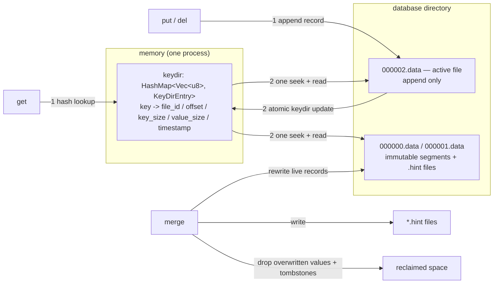

# tiny-bitcask

A minimal [Bitcask](https://riak.com/assets/bitcask-intro.pdf)-style KV store
written in Rust, built as a learning prototype: an **append-only log** plus an
**in-memory keydir**, with `get` / `put` / `del` / full scan / merge
(compaction + hint files), a CLI, and a `tokio` async wrapper.

> Background reading: [Bitcask 存储模型（日志结构哈希表）](../../docs/notes/knowledge/database/kv/bitcask.md)
> — the paper's data structures, read/write paths, trade-offs and a rosedb
> case study. This prototype implements the "one file per segment, keydir in
> memory, merge + hint file" core of that model and skips everything else.

Status: **experimental** — still being tested by hand. The Bitcask model is
implemented and the 42 tests pass, but treat the on-disk format, API and CLI as
movable until that testing is done; what the prototype deliberately does not do
is listed under [Limitations](#limitations).

## Goals

1. **Learn the Bitcask model by building it** — append-only data files, an
   in-memory hash index, tombstones, `merge`, hint files, crash recovery.
2. **Learn Rust through a real I/O program** — ownership and borrowing on a
   stateful engine, `Result`/`?` with a hand-written error enum, module
   boundaries, binary codecs (`to_le_bytes`/`try_into`), `HashMap`, `Seek`,
   `spawn_blocking`, and `#[tokio::test]` concurrency.

## Quick start

```bash
cd prototypes/tiny-bitcask

cargo build            # build the CLI
cargo test             # 42 tests: unit + integration + async
cargo clippy --all-targets -- -D warnings
cargo fmt --check
cargo run -- bench --ops 3000 --concurrency 8     # sync vs async benchmark
```

CLI walkthrough (default database directory is `./data`, gitignored):

```bash
DB="--dir /tmp/tiny-bitcask-demo"

cargo run --quiet -- $DB put user:1 alice       # OK put "user:1" (5 bytes, live keys: 1)
cargo run --quiet -- $DB put user:2 bob
cargo run --quiet -- $DB put user:1 alicia      # overwrite: the old value becomes stale
cargo run --quiet -- $DB get user:1             # alicia
cargo run --quiet -- $DB del user:2             # OK deleted "user:2" (live keys: 1)
cargo run --quiet -- $DB list                   # user:1
cargo run --quiet -- $DB files                  # 000000.data  active  94 B  -
cargo run --quiet -- $DB stats
cargo run --quiet -- $DB merge                  # merge: 1 -> 1 files, 94 B -> 26 B on disk, 1 live keys
```

Every command opens the database directory once and holds the writer lock while
it runs, so the CLI is a sequence of short-lived single-process instances —
exactly the deployment model the paper assumes. Keys and values are passed as
UTF-8 text arguments (`get` also handles arbitrary bytes on the output side via
lossy UTF-8, so binary values are better inspected through the tests).

Rotation is driven by `--max-file-size` (default 64 MiB). Use the **same** value
for the commands that write and for `merge`, otherwise merged files are packed
to a different target size:

```bash
cargo run --quiet -- --dir /tmp/db --max-file-size 512 put "key:1" "$(head -c 100 </dev/zero | tr '\0' v)"
cargo run --quiet -- --dir /tmp/db --max-file-size 512 files
# 000000.data  immutable   476 B     -
# 000001.data     active   476 B     -
cargo run --quiet -- --dir /tmp/db --max-file-size 512 merge
cargo run --quiet -- --dir /tmp/db --max-file-size 512 files
# 000002.data  immutable   480 B  hint
# 000003.data     active   484 B     -
```

`--sync` turns on `fsync` after every write (durable, much slower); rotation and
merge always sync. `--verify-reads` makes `get` re-read and CRC-check the whole
record instead of trusting the keydir and reading only the value (see
[Reads](#read-get)).

### Exit codes

| Code | Meaning                                                                   |
| ---- | ------------------------------------------------------------------------- |
| 0    | success                                                                   |
| 1    | error (I/O, corruption, lock held, ...) — printed as `error: ...` on stderr |
| 2    | invalid command line (produced by `clap`)                                  |
| 3    | `get`/`del`: the key is not in the store (`not found: ...` on stderr)      |

### Editor setup (rust-analyzer)

Opening the repo root in VS Code reports `rust-analyzer failed to fetch workspace`
(all `.rs` files unlinked, no completion or diagnostics). The editor's workspace
root is the repo root, which has no `Cargo.toml`, and rust-analyzer's project
discovery only scans that root plus its direct subdirectories — this crate sits
two levels down in `prototypes/tiny-bitcask/`. The repo's `.vscode/settings.json`
therefore links it explicitly:

```jsonc
"rust-analyzer.linkedProjects": ["prototypes/tiny-bitcask/Cargo.toml"]
```

That disables auto-discovery, so a new Rust prototype has to be added to the
list. Opening `prototypes/tiny-bitcask` itself as the VS Code folder needs no
configuration.

## The model in one picture



* Write path: one append to the active file, then an in-memory index update. No
  random writes, no in-place update, no re-reading of old data.
* Read path: one hash lookup plus at most one seek into a data file — the
  index gives the exact byte offset, so there is no read amplification.
* Space: overwritten values and tombstones stay on disk until `merge` rewrites
  the surviving records into fresh files.

## On-disk format

```
<dir>/
├── LOCK            # exclusive writer lock (flock / LockFileEx)
├── 000000.data     # immutable: rotated or merged segment
├── 000000.hint     # optional: keydir acceleration, written by merge
├── 000001.data
└── 000002.data     # active file (highest id) — the only file appended to
```

During `merge` a sibling directory `<dir>.merge/` holds the fresh output plus a
`.merge-ready` marker; see [Merge](#merge-merge) and
[Limitations](#limitations) for how an interrupted merge is recovered.

### Data record

```
┌───────────┬───────────┬──────────┬────────────┬──────┬───────┐
│ CRC       │ timestamp │ key size │ value size │ key  │ value │
│ 4 bytes   │ 4 bytes   │ 2 bytes  │ 4 bytes    │ var. │ var.  │
└───────────┴───────────┴──────────┴────────────┴──────┴───────┘
                      header 14 bytes
```

* Little-endian integers, header layout identical to Basho's `bitcask.hrl`
  (`?HEADER_SIZE = 14 = 4 + 4 + 2 + 4`).
* **CRC32 covers everything after the CRC field**: header tail + key + value.
  Every record is verified while a data file is scanned — at load time and during
  crash recovery — which is how a torn tail is detected instead of loading
  garbage. The `get` fast path does *not* re-read the header: the keydir gives the
  value offset, so it seeks straight to the value (one seek, no header read),
  exactly like rosedb; `Options::verify_reads` (CLI `--verify-reads`) switches to
  reading and checking the full record, which also confirms that the keydir entry
  still points at the requested key.
* The declared key/value lengths are validated against the bytes actually left
  in the file **before** anything is allocated, so a damaged or torn header
  cannot turn into a multi-gigabyte buffer.
* `timestamp` is Unix seconds (truncated to `u32`), stored but not used for
  conflict resolution — the keydir decides which version is live.
* Limits: key `1..=65535` bytes, value `0..=u32::MAX - 1` bytes. A value of
  length 0 is a legitimate empty value.
* **Tombstone**: `value size = 0xFFFF_FFFF` and no value bytes. This is the one
  small deviation from the paper's format (which does not reserve a sentinel);
  it keeps the 14-byte header and makes "empty value" and "deleted" disjoint.

### Hint record (`<file_id>.hint`)

```
┌───────────┬──────────┬────────────┬──────────────┬──────┐
│ timestamp │ key size │ value size │ record offset│ key  │
│ 4 bytes   │ 2 bytes  │ 4 bytes    │ 8 bytes      │ var. │
└───────────┴──────────┴────────────┴──────────────┴──────┘
                    header 18 bytes
```

Written by `merge` for every merged file **except the last one** (the last
becomes the active file and is always scanned, because it is the only file that
can still grow a torn tail). On startup, a file that has a valid hint file
rebuilds its keydir entries without reading a single value.

A hint file is treated as an optimisation only, and it must prove its
completeness before it is trusted: its entries, sorted by offset, have to tile
the data file — starting at 0, each record ending exactly where the next one
begins, the last one ending at the data file's length (merged files contain live
records only, so a correct hint has no holes). Any gap, short file, malformed
entry or foreign value makes the loader discard the hint and scan the data file,
which is always authoritative. That check is what prevents a truncated or
partially copied hint file from silently dropping every key it does not mention;
Basho gets the same guarantee from a trailing terminator record, which
tiny-bitcask does not need.

### File ids

`%06d.data` (`000000.data`, `000001.data`, …), so a directory listing sorted by
name is also sorted by id. Startup loads files in ascending id order; later
files override earlier ones for the same key, which is what makes appends
self-describing. File ids grow monotonically (merge writes new ids above every
existing file) and wrap only at `u32::MAX`, which is unreachable in practice.

## Modules

| File                 | Responsibility                                                                                                                    |
| -------------------- | --------------------------------------------------------------------------------------------------------------------------------- |
| `src/lib.rs`         | Crate root: module list and the public re-exports (`Bitcask`, `Options`, …).                                                       |
| `src/error.rs`       | `Error` enum (`Io`, `Corrupt`, `Locked`, `KeyTooLarge`, `Internal`, …), `Display`/`std::error::Error` impls, `Result<T>` alias, `From<io::Error>`, `with_path`. |
| `src/entry.rs`       | Pure codecs: data record and hint record `encode`/`decode`, the `Fill` helper that separates clean EOF from a torn record, `crc32`. |
| `src/datafile.rs`    | Directory layout: file naming/listing, `LOCK`, merge-directory naming, the append-only `ActiveFile` handle, `read_at`.             |
| `src/engine.rs`      | The engine: `open` (keydir rebuild), `put`/`get`/`delete`, rotation, `keys`/`scan`, `stats`, `merge`, crash-tail truncation.        |
| `src/async_engine.rs`| `AsyncBitcask`: `Arc<Mutex<Bitcask>>` + `spawn_blocking`, plus an async `backup_to` using `tokio::fs`.                             |
| `src/main.rs`        | `clap` CLI (`put`/`get`/`del`/`list`/`files`/`stats`/`merge`/`bench`) and the sync-vs-async benchmark.                             |
| `tests/engine.rs`    | 15 end-to-end tests for the synchronous engine.                                                                                    |
| `tests/async_engine.rs` | 3 `#[tokio::test]` tests: concurrent access, merge, async backup.                                                               |

The split is deliberate: `entry.rs` is pure functions over bytes (easy unit
tests), `datafile.rs` knows about paths and file handles but nothing about
Bitcask semantics, and `engine.rs` is the only place that holds the keydir.

## Data flow

### Startup (no log replay needed)

1. Create the directory if needed, take the exclusive `LOCK`.
2. Discard a leftover `<dir>.merge` directory (an interrupted merge is redone).
3. For every `*.data` file in ascending id order:
   * if it is not the last file and has a usable `.hint` file → load entries
     from the hint;
   * otherwise scan record by record and apply each record to the keydir
     (a tombstone removes the key).
4. The last file becomes the active file; if a scan stopped early because of a
   torn or CRC-broken trailing record, truncate the file back to the last valid
   offset.
5. No data file exists → create `000000.data`.

Because the data file *is* the log, recovery is "scan and remember the last
valid offset", not "replay a WAL".

### Write (`put` / `del`)

1. Validate the key/value sizes.
2. If appending would push the active file past `max_file_size` (and the file is
   not empty), sync and close it, then create the next file id — the old file is
   immutable from then on.
3. Encode the record (tombstone for `del`) and append it, then update the
   keydir atomically in memory. `del` appends the tombstone **before** touching
   the keydir: a crash in between leaves a harmless tombstone, never a
   resurrected key.
4. Optionally `fsync` (`--sync`).

### Read (`get`)

`keydir.get(key)` → `KeyDirEntry` → seek to `offset + 14 + key_size` in
`file_id` → read `value_size` bytes. One seek, no scan. Missing key → `None`.

With `verify_reads` the same lookup reads `header + key + value`, decodes the
record (length checks + CRC32), compares the record's key with the requested one
and only then returns the value: one extra header read per `get`, in exchange for
catching corruption that appeared after the file was loaded. The key comparison
is what turns a wrong hint-file mapping into an error instead of a wrong value.

### Merge (`merge`)

1. Snapshot the keydir (live keys only) and sort by `(file_id, offset)` so the
   rewrite preserves log order.
2. Create `<dir>.merge` (a sibling, so the final moves are plain renames) and
   write every live record into fresh files with ids above the current maximum,
   rotating at `max_file_size`. Tombstones and overwritten values simply do not
   appear in the output.
3. Write a `.hint` file for each merged file except the last, then write and
   fsync a `.merge-ready` marker: the output is complete and durable, and the
   next `open` may move it in if this process dies from here on.
4. `rename` the merged files into the database directory **first**, then remove
   the old `*.data`/`*.hint` files. New ids are always above every existing id,
   so the two generations can coexist.
5. Close the old handles (a Windows process cannot unlink a file it still has
   open) and prune the superseded files, best effort: a leftover old file is
   harmless (higher ids win on load) and the next merge retries. If one cannot
   be removed, `merge` reports `Error::PruneFailed` **after** the merge state is
   committed, so the store stays correct and usable.
6. Reopen the last merged file as the active file, drop the merge directory and
   swap in the new keydir.

**Crash recovery.** `<dir>.merge` is never deleted blindly:

* **before the marker** — the merge had not finished writing its output and no
  old file has been touched, so the directory is discarded and nothing is lost;
* **after the marker** — the leftovers are a complete generation whose ids are
  above everything in the database directory, so they are moved in before the
  directory is removed. That finishes a crash in the middle of the renames: the
  newest version of every record is on disk, with the old files left for the
  prune step (which is why a key deleted before the merge can come back — see
  [Limitations](#limitations)).

The result is `disk_bytes == live_bytes` (stale bytes drop to zero) and a
startup that reads no values at all.

## Async design

The storage engine stays synchronous; the async layer moves calls onto Tokio's
blocking pool instead of rewriting file I/O as `async`:

```rust
// src/async_engine.rs (abridged)
pub struct AsyncBitcask { inner: Arc<Mutex<Bitcask>> }

async fn with_engine<T, F>(&self, operation: F) -> Result<T>
where F: FnOnce(&mut Bitcask) -> Result<T> + Send + 'static, T: Send + 'static {
    let db = Arc::clone(&self.inner);
    tokio::task::spawn_blocking(move || operation(&mut db.lock()?)).await?
}
```

Why this shape:

* **Blocking I/O belongs on the blocking pool.** `spawn_blocking` keeps the async
  worker threads free to poll other tasks; the `Send + 'static` bounds on `F`
  are exactly what forces keys/values to be owned `Vec<u8>` (no borrowed slices
  across an `await`).
* **The engine is single-writer by design**, and its cursor-based readers are
  serialised anyway, so one `Mutex` is an honest model of the real constraint —
  no lock-free pretence.
* **`tokio::fs` where it actually helps.** `backup_to` copies data and hint
  files with `tokio::fs::copy` through a staging directory and renames each file
  into place, so a backup can only ever contain complete files (rotated files
  are immutable, so a block-order copy is a valid Bitcask backup). The last step
  writes a `.backup-complete` marker listing `files=`/`bytes=`, so an interrupted
  run is distinguishable from a finished one; `Bitcask::open` ignores it.
* The same synchronous functions power the CLI, the tests and the async wrapper,
  so there is only one implementation of every operation.

Sample benchmark (`bench --ops 3000 --concurrency 8`, release build, M-series
laptop, throwaway directory, one of three runs):

| phase                                |    ops | throughput  |
| ------------------------------------ | -----: | ----------: |
| async puts (sequential `await`)      |   3000 | 142k ops/s  |
| async puts (8 concurrent tasks)      |   3000 | 124k ops/s  |
| async gets (8 concurrent tasks)      |   3000 | 138k ops/s  |

The interesting result is that concurrency does **not** help: every operation
funnels through the same `Mutex` and every `put` appends to the same file, so
the async wrapper buys non-blocking ergonomics (and a place to hang timers,
retries, fan-out), not parallel writes. Bitcask's bet is sequential writes, and
this benchmark makes that concrete.

## Deviations from the paper (and why)

| Topic              | Paper / Basho                              | tiny-bitcask                                                                 | Reason                                                        |
| ------------------ | ------------------------------------------ | ---------------------------------------------------------------------------- | ------------------------------------------------------------- |
| keydir structure   | hash table                                 | `HashMap<Vec<u8>, KeyDirEntry>`                                              | Follows the paper; rosedb's BTree is the alternative for range scans. |
| keydir contents    | `file_id, offset, size`                    | adds `key_size`, `timestamp`                                                 | Read skips re-parsing the header; timestamp is free statistics. |
| tombstones         | separate deletion record convention        | `value_size = 0xFFFF_FFFF` sentinel                                          | Keeps the 14-byte header while keeping empty values valid.    |
| hint files         | 18-byte header + trailing terminator CRC   | 18-byte header, no terminator; completeness is proven by checking that the entries tile the data file | No extra format element, and a truncated hint is still detected. |
| merge output       | merge into a sibling dir, then swap        | merge into `<dir>.merge` with a `.merge-ready` marker, rename the new files in, then prune the old ones | Same idea; marker recovery finishes a crash in the middle of the swap. |
| merge crash safety | `.MERGEFIN` marker + restart policy        | `.merge-ready` marker + recovery at open: no data loss and no stale reads, but a crash between the rename and prune steps can resurrect pre-merge-deleted keys | Deliberately out of scope for a teaching prototype.           |
| concurrent readers | read-only opens allowed alongside the writer | every `open` takes the exclusive lock                                        | One lock is simpler than a reader/writer lock split.          |
| durability         | configurable sync                          | `--sync` opt-in; always sync on rotate/merge                                 | Same trade-off, explicit knob.                                |
| read verification  | checksum on read (cheap for small records)  | keydir fast path by default; `--verify-reads` re-reads and checks the record | Keeps the paper's "one seek" read while making the safe mode available. |
| TTL / expiry       | timestamp in the header, no TTL itself     | timestamp stored, no expiry logic                                            | Not needed to learn the model.                                |
| batch / ordered iteration / watch / compression | not in the paper           | not implemented                                                              | Out of scope (rosedb has all of them).                        |

## Tests

`cargo test` — 42 tests, all offline and filesystem-isolated (`tempfile`):

| Test                                              | Covers                                                              |
| ------------------------------------------------- | ------------------------------------------------------------------- |
| `entry::tests::*` (10)                            | record/hint codecs, empty value vs tombstone, CRC mismatch, torn tail, empty key, oversized lengths rejected before allocating |
| `engine::tests::*` (5)                            | put/get/delete round trip, key & value bounds, empty values, writer lock, zero rotation threshold clamped |
| `put_overwrite_delete_roundtrip`                  | overwrite leaves stale bytes, delete is idempotent                  |
| `verify_reads_detects_a_corrupted_value`          | a flipped value bit fails `get` when `verify_reads` is on            |
| `fast_reads_return_stored_bytes_without_checking_the_crc` | the default fast path returns the stored bytes without verifying |
| `symlinked_data_file_is_still_read` (unix)        | a segment behind a symlink is still loaded (only directories are skipped) |
| `reopen_rebuilds_the_keydir_from_the_log`         | keydir rebuilt from the log, tombstones respected                   |
| `empty_values_survive_reopen`, `large_values_roundtrip` | edge-case values (256 KiB)                                    |
| `scan_returns_sorted_live_pairs`                  | full scan order and content                                         |
| `rotation_splits_the_log_into_multiple_files`     | rotation at `max_file_size`, reload across files                    |
| `torn_tail_is_truncated_on_open`                  | crash recovery: partial record cut off, file shrinks back           |
| `crc_mismatch_in_the_tail_is_dropped`             | checksum failure in the active file is treated as a torn tail       |
| `corruption_in_an_immutable_file_is_reported`     | damage in a rotated file surfaces as `Error::Corrupt`               |
| `directory_masquerading_as_a_data_file_is_ignored`| a directory named `NNN.data` is not mistaken for a data file        |
| `merge_reclaims_space_and_keeps_live_data`        | merge drops stale records, `stale_bytes == 0`, data survives reload |
| `merge_writes_hint_files_for_immutable_files`     | hint files exist for all but the active file                        |
| `merge_preserves_empty_values`                    | a live `value_size == 0` record survives a merge (not treated as a tombstone) |
| `merge_reports_superseded_files_it_cannot_remove` | prune failure → `Error::PruneFailed` with the merge still committed |
| `truncated_hint_file_falls_back_to_scanning`      | a hint mentioning only part of its file is rejected → data file scanned |
| `corrupt_hint_file_falls_back_to_scanning`        | a garbage hint file is rejected → data file scanned                 |
| `key_limits_are_enforced`                         | empty key and over-long key are rejected                            |
| `merge_with_no_live_keys_recreates_an_empty_active_file` | empty-keydir merge stays usable                              |
| `only_one_process_can_hold_the_writer_lock`       | second `open` fails with `Error::Locked`                            |
| `leftover_merge_directory_is_discarded_on_open`   | interrupted merge without a completion marker is cleaned up          |
| `interrupted_merge_output_is_recovered_on_open`   | marked merge output is moved in and wins over the old generation     |
| async: `concurrent_puts_and_gets_share_one_engine`| 4 tasks × 50 puts, concurrent reads, deletes                        |
| async: `merge_and_backup_are_usable_from_the_copied_directory` | merge + `backup_to` + reopening the copy with the sync engine |
| async: `sequential_and_concurrent_writes_do_not_lose_keys` | 200 sequential + 8 × 100 concurrent writes → exactly 1000 keys |

## Limitations

* **The whole keyspace must fit in memory.** The keydir is a full hash map of
  live keys — the defining Bitcask trade-off, not a bug.
* **Merge has no data-loss window, only a resurrection one.** The merged output
  is written, synced and marked with `.merge-ready` before anything in the
  database directory is touched, and `open` moves marked leftovers in before
  discarding `<dir>.merge`. So whether the crash happened before, during or after
  the renames, the newest version of every record is on disk — never a missing
  key and never a stale value. What a crash between the rename and prune steps
  *can* do is resurrect keys that were deleted before the merge, because their
  old records are still in an unpruned file; rosedb solves that with a slightly
  different restart policy over the same marker idea.
* **A prune failure is reported, not hidden.** If a superseded file cannot be
  removed, `merge` returns `Error::PruneFailed` after committing the merge: the
  store is correct and usable, the leftover file is harmless, and the next merge
  retries.
* **A failed rename leaves the store for the caller to reopen.** Same reason as
  above, but in reverse: the merged files are moved one by one, so a rename error
  can leave part of a new generation in place. The error is returned and the
  directory should be reopened rather than reused.
* **Values are not checksum-verified on the read path by default.** `get` trusts
  the keydir and reads only the value bytes, so a damaged value is returned as-is
  once the file has been loaded. `Options::verify_reads` (CLI `--verify-reads`)
  turns on full-record verification per read at the cost of an extra header read;
  the CRC is always checked when a file is loaded.
* **A corrupt trailing record in the active file truncates the tail**, including
  any valid records after the damaged one. That is the documented Bitcask
  recovery behaviour (the tail is assumed to be a partial write). The declared
  lengths of a damaged header are also bounded by the remaining file size before
  any buffer is allocated, so a garbage header cannot trigger a huge allocation.
* **A hint file is never trusted blindly**: an incomplete hint loses its
  acceleration and the data file is scanned instead.
* **Single writer, and every `open` takes the writer lock** — read-only
  concurrent opens (allowed by the paper) are not implemented.
* **No range scan.** `keys`/`scan` collect and sort the keydir, so they are
  O(n log n) in memory plus one disk read per key. An ordered in-memory index
  (BTree) is what rosedb chose for this.
* **No TTL, no batch, no compression.**

## Possible extensions

* A restart policy that keeps pre-merge tombstones, so even the resurrection
  window closes.
* Batch writes (one record carrying several key/value pairs) and a batch id.
* Ordered keydir (BTree) for range scans and cheaper `keys`.
* Reader/writer lock split so read-only opens do not block a writer.
* TTL/expiry using the stored timestamp.
* Value compression, or the WiscKey split (keys in the index, values in a
  separate log).

## Rust notes (what the prototype exercises)

| Concept                              | Where                                                                 |
| ------------------------------------ | --------------------------------------------------------------------- |
| Ownership / borrowing                | `Bitcask` owns the keydir and file handles; `get(&mut self)` exists because `File` owns a cursor. |
| `Result` + `?` + custom error enum   | `src/error.rs`, `From<io::Error>`, `Display`/`source`.                 |
| Trait impls on std types             | `impl std::error::Error for Error`, `Default for Options`, builder methods. |
| Slices vs `Vec<u8>`                  | `put(&[u8], &[u8])` at the edge, `Vec<u8>` as the `HashMap` key.        |
| Byte codecs                          | `to_le_bytes`, `from_le_bytes`, `copy_from_slice`, `crc32fast::Hasher`. |
| `Option` and pattern matching        | tombstone = `None`; `match`/`if let`/`let ... else` throughout.        |
| Modules and visibility               | `lib.rs` + `pub`/private split between codecs, layout and engine.      |
| `Seek`/`Read`/`Write` traits         | `read_at`, `BufReader` scanning, append-only writes.                   |
| `Drop`-as-close + RAII lock          | `ActiveFile` closes when replaced; `_lock: File` holds the flock.      |
| `Arc<Mutex<T>>` + `spawn_blocking`   | `src/async_engine.rs`, including the `Send + 'static` bounds.          |
| Async file I/O                       | `tokio::fs` copies through a staging directory in `backup_to`, one rename per file. |
| Integration testing                  | `tests/` + `tempfile`, plus `#[tokio::test]`.                          |
| CLI parsing                          | `clap` derive in `src/main.rs`.                                        |

## References

* Paper: [Bitcask: A Log-Structured Hash Table for Fast Key/Value Data](https://riak.com/assets/bitcask-intro.pdf) (Basho, 2010)
* Knowledge note: [Bitcask 存储模型](../../docs/notes/knowledge/database/kv/bitcask.md) — model, read/write paths, pros & cons, implementation list
* [rosedb](https://github.com/rosedblabs/rosedb) (Go) — production-shaped implementation: WAL segments, BTree index, `.MERGEFIN` merge
* [mini-bitcask](https://github.com/rosedblabs/mini-bitcask) (Go) — the closest reference for "smallest correct Bitcask"
* [basho/bitcask](https://github.com/basho/bitcask) (Erlang) — original implementation; `include/bitcask.hrl` defines the 14-byte header and the 18-byte hint record
